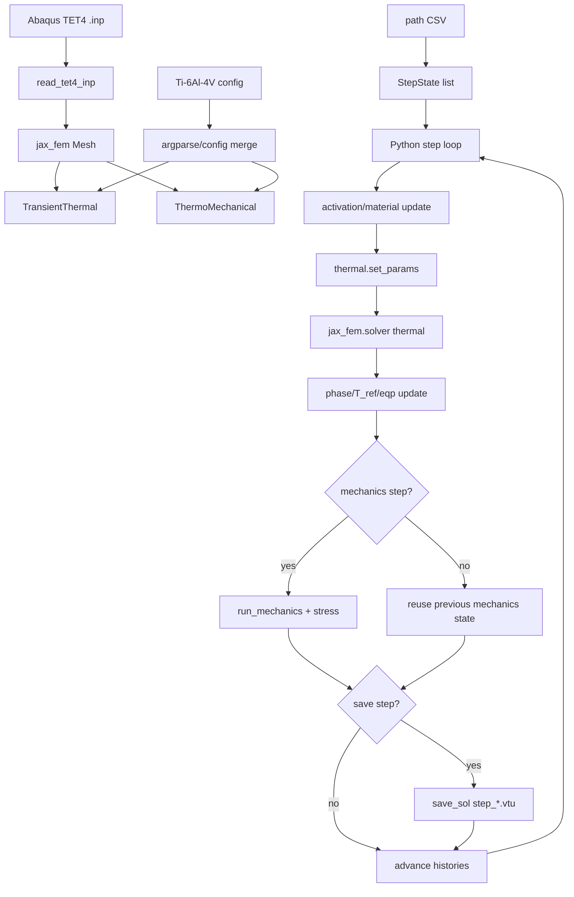

# v03 XLA 热-力 FEM 应力求解模块架构与 GPU 优化路线

日期：2026-07-06

范围：本文档基于本地 WSL 仓库 `/home/user/work/159/jax-fem` 的实际代码扫描生成，当前分支为 `test`。重点关注 v03 宏观热-力应力求解器、XLA/JAX 包装器、运行脚本、本地 git 管理边界，以及后续基于 JAX 的 GPU 加速优化路线。

## 1. 扫描结论

当前 v03 XLA 代码已经具备“GPU 可见 + JAX 线性求解器可切换”的能力，但还不是完整的全流程 XLA/GPU 热-力求解器。

准确表述应为：

> 当前模块是一个保留原始热-力物理流程的 FEM 求解器，并通过 XLA 包装器把原始 `spsolve_solver` 线性求解路径替换为可选的 `jax_solver` / `amgx_solver` / `petsc_solver` / `spsolve_solver`。它支持 JAX 识别 GPU，但原始 Python transient loop、PETSc 矩阵装配、SciPy/JAX 稀疏矩阵转换和 VTU 输出仍然存在。

因此，现阶段能够实现的是：

- TET4 网格宏观热-力耦合计算。
- Ti-6Al-4V 材料配置和温度相关材料表读取。
- 基于路径文件的逐步扫描热源加载。
- `layer_on_scan` 层激活和 `intersection` 粗网格层带相交判定。
- 移动热活动窗口和旧层热导衰减。
- 线弹性热应力求解，支持按 `mechanics-every` 间隔执行。
- 简化 `j2_plastic` 路径。
- quadrature stress、von Mises 和温度/位移 VTU 输出。
- XLA 包装器选择 JAX/PETSc/AMGX/SciPy 线性求解器。
- JAX dry-run 可识别 `CudaDevice(id=0)`。

现阶段还不能声称的是：

- 不能说整个扫描循环已经 XLA 编译。
- 不能说热-力耦合主循环已经完全在 GPU 上运行。
- 不能说 `jax_solver` 一定比 CPU `spsolve_solver` 快。
- 不能把 dry-run 或 wrapper unit test 当成正式物理验证。

## 2. 相关文件地图

| 文件 | 作用 |
| --- | --- |
| `159_local/v03/am_thermal_stress_macro_intersection_mech100.py` | 原始 v03 主求解器，约 2247 行。负责完整热-力 FEM 流程。 |
| `159_local/v03/am_thermal_stress_macro_intersection_mech100_XLA.py` | 当前 XLA/JAX 包装器，约 322 行。保留原始物理代码，只改运行环境和线性求解器选择。 |
| `159_local/v03/run_macro_intersection_h60_mech100.sh` | 原始 h60/mech100 启动脚本。调用原始 `.py`，默认走 CPU `spsolve_solver`。 |
| `159_local/v03/run_macro_intersection_h60_mech100_XLA.sh` | 当前 XLA 启动脚本。调用 XLA 包装器，默认 `--xla-linear-solver jax`。 |
| `159_local/v03/run_macro_speedup.sh` | 参数层面的降步数/降输出频率加速脚本。它会检查 JAX 设备，但当前仍调用原始求解器，不是 XLA 包装器。 |
| `tests/test_v03_xla_wrapper.py` | XLA 包装器单元测试。验证 solver option 映射和重写逻辑。 |
| `jax_fem/solver.py` | 共享非线性/线性求解器栈。定义 `jax_solver`、`spsolve_solver`、`petsc_solver`、`amgx_solver` 的实际分发。 |

## 3. 本地 Git 状态与管理边界

扫描时仓库路径为：

```bash
/home/user/work/159/jax-fem
```

当前分支：

```bash
test
```

以下 XLA 相关文件已经被 git 跟踪：

```bash
git ls-files \
  159_local/v03/am_thermal_stress_macro_intersection_mech100_XLA.py \
  159_local/v03/run_macro_intersection_h60_mech100_XLA.sh \
  tests/test_v03_xla_wrapper.py
```

本文档是新增文件：

```bash
159_local/v03/V03_XLA_ARCHITECTURE_AND_GPU_ROADMAP.md
```

建议提交时作为单独的文档提交：

```bash
git add 159_local/v03/V03_XLA_ARCHITECTURE_AND_GPU_ROADMAP.md
git commit -m "docs: document v03 xla thermal-mechanical architecture"
```

后续 GPU/JAX 优化时建议拆分提交：

| 提交类型 | 内容 |
| --- | --- |
| `docs:` | 架构文档、运行说明、验证说明。 |
| `test:` | benchmark、smoke test、回归测试。 |
| `refactor:` | 不改变行为的函数拆分或模块整理。 |
| `feat:` | 新增求解器路径或新运行能力。 |
| `perf:` | 有前后对比数据的性能优化。 |

不要把 `/home/user/work/159/output` 下的大量 VTU、CSV、log 结果文件提交进 git。

## 4. 运行环境

稳定运行环境是 WSL Ubuntu + conda：

```bash
cd /home/user/work/159/jax-fem
source /home/user/miniforge3/etc/profile.d/conda.sh
conda activate jax-fem-env
```

v03 仍依赖 `159_local/v01` 中的 `read_tet4_inp`，因此运行时需要：

```bash
PYTHONPATH=/home/user/work/159/jax-fem/159_local/v01:/home/user/work/159/jax-fem
```

材料配置文件路径在脚本中是相对 `/home/user/work/159` 的：

```bash
--config materials/Ti-6Al-4V/ti64_material_config_initial.json
```

所以运行脚本内部先执行：

```bash
cd /home/user/work/159
```

## 5. 当前 XLA 启动脚本

推荐 dry-run：

```bash
wsl.exe -d Ubuntu -- /home/user/work/159/jax-fem/159_local/v03/run_macro_intersection_h60_mech100_XLA.sh --xla-dry-run
```

正式运行：

```bash
wsl.exe -d Ubuntu -- /home/user/work/159/jax-fem/159_local/v03/run_macro_intersection_h60_mech100_XLA.sh
```

当前 XLA 启动脚本核心参数：

```bash
--xla-platform gpu
--xla-preallocate off
--xla-linear-solver jax
--xla-fallback-to-spsolve
--xla-show-devices
--thermal-output-every 1000
--mechanics-output-every 1000
--summary-every 100
```

当前输出目录：

```bash
/home/user/work/159/output/thermal_macro1mm_intersection_first10_h60_mech100_xla
```

当前路径文件：

```bash
/home/user/work/159/output/geometry_path_macro1mm_first10_h60/path_macro1mm_first10_h60.csv
```

该路径文件扫描到的规模是 `825877` 行，包括表头，即约 `825876` 个扫描步。这是后续性能优化必须重点关注的事实。

## 6. XLA dry-run 当前验证结果

已验证命令：

```bash
wsl.exe -d Ubuntu -- /home/user/work/159/jax-fem/159_local/v03/run_macro_intersection_h60_mech100_XLA.sh --xla-dry-run
```

输出关键信息：

```text
linear_solver_override = jax_solver(precond=True)
xla_platform           = gpu
xla_preallocate       = off
fallback_to_spsolve   = True
full_loop_xla         = disabled; original Python/jax-fem loop is preserved
JAX devices: [CudaDevice(id=0)]
JAX default backend: gpu
JAX enable x64: True
```

这说明：

- JAX 能识别 GPU。
- XLA 包装器能正确选择 `jax_solver`。
- 当前包装器明确声明 `full_loop_xla = disabled`。
- 原始 Python/jax-fem 主循环仍然保留。

## 7. 原始 v03 求解器架构

原始主文件：

```bash
159_local/v03/am_thermal_stress_macro_intersection_mech100.py
```

核心结构：

| 结构 | 作用 |
| --- | --- |
| `StepState` | 单个扫描/冷却/recoat/jump 步的状态数据。 |
| `PropertyTable` | 从 CSV 表读取温度相关材料属性。 |
| `TransientThermal(Problem)` | 热传导、热源、热容、边界换热、体积热损失。 |
| `ThermoMechanical(Problem)` | 小变形热弹性/简化 J2 应力模型。 |
| `generate_path_file_step_states(...)` | 从路径 CSV 生成逐步扫描状态。 |
| `thermal_material_quads(...)` | 按相态生成热属性 quadrature 场。 |
| `mechanics_material_quads(...)` | 按相态生成力学属性 quadrature 场。 |
| `update_phase_reference_and_eqp(...)` | 更新相态、应力自由参考温度、等效塑性应变。 |
| `run_mechanics(...)` | 运行力学求解器。 |
| `save_step(...)` | 写 VTU 输出。 |
| `main()` | 总控流程。 |

### 7.1 输入

主要输入包括：

- `.inp` TET4 网格。
- Ti-6Al-4V JSON config。
- 温度相关材料表。
- 扫描路径 CSV。
- 激光功率、吸收率、束斑半径、热源深度。
- 层厚、激活模式、活动窗口设置。
- 力学求解频率和输出频率。

### 7.2 热求解

`TransientThermal` 支持：

- TET4 热传导。
- 隐式时间步热容项。
- 体积高斯激光热源。
- 沿 build axis 的指数衰减热源深度。
- 对流/辐射边界。
- moving front 体积损失近似。
- old layer cooling sink。
- 粉末、空洞、固体、糊状区、液体、基板、支撑等相态。
- 潜热等效热容。

### 7.3 力学应力求解

`ThermoMechanical` 支持：

- 3D 小变形应变：

```text
eps = 0.5 * (grad_u + grad_u.T)
```

- 热应变：

```text
thermal_eps = alpha * dT * I
```

- 线弹性应力：

```text
sigma = lambda * tr(elastic_eps) * I + 2 * mu * elastic_eps
```

- 可选简化 `j2_plastic` 应力裁剪。
- quadrature-level `stress_quad` 和 `vm_quad` 输出。

当前主运行使用：

```bash
--mechanics-model linear_elastic
--mechanics-every 100
```

即每 100 个 global step 执行一次力学求解，并在最后一步强制执行。

## 8. 主循环数据流

当前主循环仍是 Python 层逐步循环：

```text
for state in step_states:
    更新当前层激活状态
    生成 active/printed/cooling_only quadrature 场
    更新热材料参数
    thermal.set_params(...)
    solver(thermal, ...)
    计算 cell 温度
    更新相态、T_ref、eqp
    按 mechanics-every 判断是否力学求解
    按 output-every 判断是否写 VTU
    T_old = T_new
```

架构流程：



## 9. 层激活与移动窗口

当前 XLA 启动脚本使用：

```bash
--layer-activation-mode layer_on_scan
--layer-activation-geometry intersection
--future-layer-mode void
--active-window-below-layers 5
--old-layer-thermal-factor 1.0e-6
--old-layer-cooling-h 1.0e4
```

含义：

- `layer_on_scan`：当前层开始扫描时整层进入 printed 状态。
- `intersection`：用 cell 顶点沿 build axis 的区间和层带相交判断激活，适合当前粗 TET4 宏观层网格。
- `future-layer-mode void`：未来层在铺粉/扫描前近似为空洞，不提前作为粉末热沉。
- `active-window-below-layers 5`：热求解只保留当前层附近若干层为主要活跃热窗口。
- 旧层保留热历史，但热导通过 `old-layer-thermal-factor` 大幅衰减，并可通过 `old-layer-cooling-h` 加体积冷却。
- 力学参与不是只限热窗口，而是使用所有 printed material。

## 10. 输出逻辑

输出函数为 `save_step(...)`，写入：

- 点场：`T`、`u`
- 单元场：`active`、`printed`、`cooling_only`
- 层和相态信息
- 激活温度、应力自由温度、凝固步
- `dT`
- `eq_plastic_strain`
- `max_temperature_history`
- `mechanics_valid`
- `mechanics_source_step`
- `stress_quad_*`
- `vm_quad`

VTU 保存条件：

```text
最后一步一定保存
或者 did_mechanics 且 global_step % mechanics_output_every == 0
或者 global_step % thermal_output_every == 0
```

因此当前：

```bash
--thermal-output-every 1000
--mechanics-output-every 1000
```

能显著减少 VTU 数量，但不会减少热求解步数。

## 11. XLA 包装器实现

XLA 包装器文件：

```bash
159_local/v03/am_thermal_stress_macro_intersection_mech100_XLA.py
```

它的职责不是重写物理求解器，而是：

1. 在导入原始模块前解析 XLA/JAX runtime 参数。
2. 设置 `JAX_PLATFORM_NAME`、`XLA_PYTHON_CLIENT_PREALLOCATE`、`XLA_PYTHON_CLIENT_MEM_FRACTION`。
3. 用 `importlib` 加载原始 `am_thermal_stress_macro_intersection_mech100.py`。
4. 复用原始 parser，并追加 XLA 参数。
5. 将 `--xla-linear-solver` 翻译为 `jax_fem.solver` 的 nested `solver_options`。
6. monkey patch 原始模块中的 `solver` 符号。
7. 调用原始模块的 `main()`。

支持的线性求解器选择：

```bash
--xla-linear-solver jax
--xla-linear-solver amgx
--xla-linear-solver petsc
--xla-linear-solver spsolve
--xla-linear-solver preserve
```

默认：

```bash
--xla-linear-solver jax
--xla-jax-precond
--xla-fallback-to-spsolve
```

如果实验性求解器失败，且启用了 fallback，则本次 solve 会回退到：

```python
{"spsolve_solver": {}}
```

## 12. 当前 GPU 加速边界

`jax_fem/solver.py` 中当前 `jax_solver` 路径是：

```text
PETSc Mat
  -> getValuesCSR()
  -> scipy.sparse.csr_array
  -> jax.experimental.sparse.BCOO
  -> jax.scipy.sparse.linalg.bicgstab
```

因此当前 GPU 利用率可能不高，原因包括：

- 每个热步都在 Python 层循环。
- 每步仍要更新 PETSc tangent matrix。
- `jax_solver` 每次都存在 PETSc/SciPy/JAX 稀疏矩阵转换。
- 路径文件有约 82.6 万个扫描步，固定开销被重复放大。
- 对中小规模稀疏系统，CPU `spsolve` 直接法可能并不慢。
- 输出虽然降频，但 VTU 写出仍在 host 侧。

结论：

> 当前 XLA 包装器更像是“JAX/GPU 线性求解器尝试层”，不是“完整 GPU FEM 求解器”。

## 13. run_macro_speedup.sh 的定位

`run_macro_speedup.sh` 做了这些事：

- 设置 `JAX_PLATFORM_NAME=gpu`。
- 设置 JAX 显存预分配。
- 降低 scan steps per segment。
- 增大 `dt`。
- 减少 cooling steps。
- 调整 VTU 输出频率。
- 生成新的全件路径 CSV。
- 运行全件热-力仿真。

但它当前调用的是：

```bash
python3 /home/user/work/159/jax-fem/159_local/v03/am_thermal_stress_macro_intersection_mech100.py
```

不是：

```bash
python /home/user/work/159/jax-fem/159_local/v03/am_thermal_stress_macro_intersection_mech100_XLA.py
```

所以它是“参数层面加速/减步数脚本”，不是当前 XLA 包装器启动脚本。

如果未来要做全件 XLA 对比，可以新增一个专门的 `run_macro_speedup_XLA.sh`，不要直接覆盖原脚本。

## 14. 已验证内容

XLA 包装器单元测试通过：

```bash
cd /home/user/work/159/jax-fem
source /home/user/miniforge3/etc/profile.d/conda.sh
conda activate jax-fem-env
PYTHONDONTWRITEBYTECODE=1 python3 -m unittest tests.test_v03_xla_wrapper
```

结果：

```text
Ran 4 tests in 0.004s
OK
```

XLA launcher dry-run 通过，并识别：

```text
JAX devices: [CudaDevice(id=0)]
JAX default backend: gpu
```

这些验证覆盖：

- wrapper 参数解析。
- solver option 重写。
- JAX GPU 可见性。
- 启动脚本基本可运行。

这些验证不覆盖：

- 全量路径物理正确性。
- 残余应力定量验证。
- GPU 加速收益。
- 长时间运行稳定性。

## 15. 后续 GPU/JAX 优化路线

后续优化应先测量，再改代码。

### Phase 1：建立 profiling harness

建议新增三个规模：

| 规模 | 用途 |
| --- | --- |
| tiny | 秒级 smoke test，验证 wiring。 |
| medium | 可重复性能对比，观察 solver 差异。 |
| representative | 截取真实 h60/mech100 的代表性路径片段。 |

对比求解器：

```bash
--xla-linear-solver spsolve
--xla-linear-solver jax
--xla-linear-solver petsc
--xla-linear-solver amgx
```

采集指标：

- `/usr/bin/time -v` wall time。
- `jax_fem` 日志中的 `local`、`global`、`linear`、`other` 时间。
- 热步数量。
- 力学求解次数。
- VTU 文件数量。
- `nvidia-smi` GPU 显存和利用率。

### Phase 2：减少主循环固定开销

当前路径文件约 `825876` 个扫描步。任何每步固定开销都会被放大。

优先评估：

- 降低 `scan_steps_per_segment`。
- 增大但物理可接受的 `dt`。
- 减少 mechanics frequency。
- 减少 VTU 输出。
- 将热校准和完整应力求解分成不同 run。

这些可能比单纯切换 `jax_solver` 更快见效。

### Phase 3：JIT 化状态更新 kernel

优先抽出固定 shape、纯数组逻辑：

- activation mask。
- phase update。
- `T_ref` update。
- thermal material quadrature update。
- mechanical material quadrature update。
- stress/von Mises postprocess。

这些函数适合逐步加 `jax.jit`，比直接把整个主循环塞进 `lax.scan` 风险更低。

### Phase 4：清理线性求解器数据通路

当前最大问题之一是：

```text
PETSc Mat -> SciPy CSR -> JAX BCOO
```

未来方向：

- 避免每步重复转换矩阵格式。
- 研究 JAX-native sparse assembly。
- 研究持久化 AMGX resources，避免每次 setup/destroy。
- 研究 PETSc GPU-aware matrix/vector 路径。
- 对热问题探索固定 sparsity pattern 的复用。

### Phase 5：尝试 full-loop XLA

只有满足以下条件后，才适合考虑 `jax.lax.scan` 或更大粒度 JIT：

- step state 变成固定 shape 数组。
- 主循环内没有 Python 文件写出。
- 主循环内没有 Python 对象突变。
- 热历史、相态、`T_ref`、`eqp` 都是 JAX state。
- solver 路径不再每步依赖 PETSc/SciPy host callback。

否则 full-loop XLA 很容易只是形式上 JIT，实际仍被 host callback 和 sparse bridge 卡住。

## 16. 推荐下一步

短期最实际的下一步：

1. 保留当前 XLA wrapper。
2. 新增一个 profiling 脚本，自动比较 `spsolve` 和 `jax`。
3. 截取 1000、5000、20000 步路径做固定 benchmark。
4. 把 `Timing summary` 解析成 CSV。
5. 再根据数据决定是优化线性 solver、矩阵装配、路径步数，还是输出 I/O。

建议不要先大规模重写为 `lax.scan`。当前代码的主要边界还在 Python step loop、PETSc/SciPy/JAX sparse bridge 和海量扫描步数。
