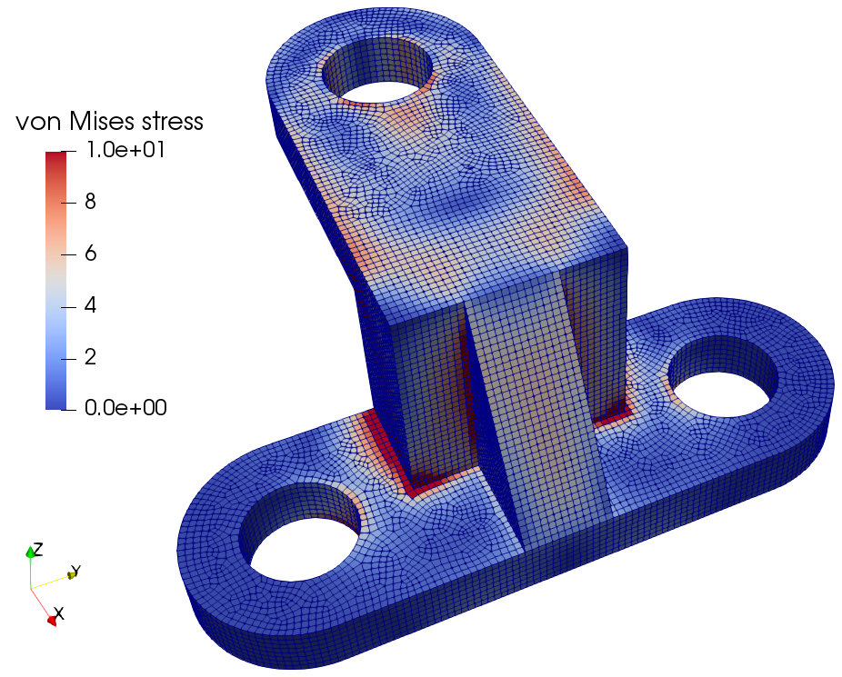
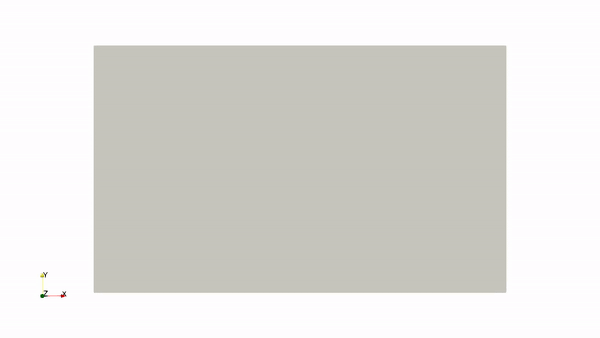

# JAX-FEM


JAX-FEM is a differentiable finite element package based on [JAX](https://github.com/google/jax).

## Documentation

For installation and user guide, please visit our [documentation](https://deepmodeling.github.io/jax-fem/) for details.

## Key features

JAX-FEM is Automatic Differentiation (AD) + Finite Element Method (FEM), and we support the following features:

- 2D quadrilateral/triangle elements
- 3D hexahedron/tetrahedron elements
- First and second order elements
- Dirichlet/Neumann/Robin boundary conditions
- Linear and nonlinear analysis including
  - Heat equation
  - Linear elasticity
  - Hyperelasticity
  - Plasticity (macro and crystal plasticity)
- Multi-physics problems
- Integration with PETSc for solver options
- Differentiable programming for solving inverse/design problems __without__ deriving sensitivities by hand, e.g.,
  - Topology optimization
  - Optimal thermal control

<!-- **Updates** (Dec 11, 2023):
- We now support multi-physics problems in the sense that multiple variables can be solved monolithically. For example, consider running  `python -m applications.stokes.example`
- Weak form is now defined through  volume integral and surface integral. We can now treat body force, "mass kernel" and "Laplace kernel" in a unified way through volume integral, and treat "Neumann B.C." and "Robin B.C." in a unified way through surface integral.  -->

## Examples

<p align="middle">
  
</p>
<p align="middle">
    <em >Thermal profile in direct energy deposition.</em>
</p>

<p align="middle">
  
</p>
<p align="middle">
    <em >Linear static analysis of a bracket.</em>
</p>

<p align="middle">
  
  
</p>
<p align="middle">
    <em >Crystal plasticity: grain structure (left) and stress-xx (right).</em>
</p>

<p align="middle">
  
  
</p>
<p align="middle">
    <em >Stokes flow: velocity (left) and pressure(right).</em>
</p>

<p align="middle">
  
</p>
<p align="middle">
    <em >Topology optimization with differentiable simulation.</em>
</p>


## License

This project is licensed under the GNU General Public License v3 - see the [LICENSE](https://www.gnu.org/licenses/) for details. For commercial use, contact [Tianju Xue](https://ce.hkust.edu.hk/people/tian-ju-xue-xuetianju).

## Citations

If you found this library useful in academic or industry work, we appreciate your support if you consider 1) starring the project on Github, and 2) citing relevant papers:

```bibtex
@article{xue2023jax,
  title={JAX-FEM: A differentiable GPU-accelerated 3D finite element solver for automatic inverse design and mechanistic data science},
  author={Xue, Tianju and Liao, Shuheng and Gan, Zhengtao and Park, Chanwook and Xie, Xiaoyu and Liu, Wing Kam and Cao, Jian},
  journal={Computer Physics Communications},
  pages={108802},
  year={2023},
  publisher={Elsevier}
}
```

