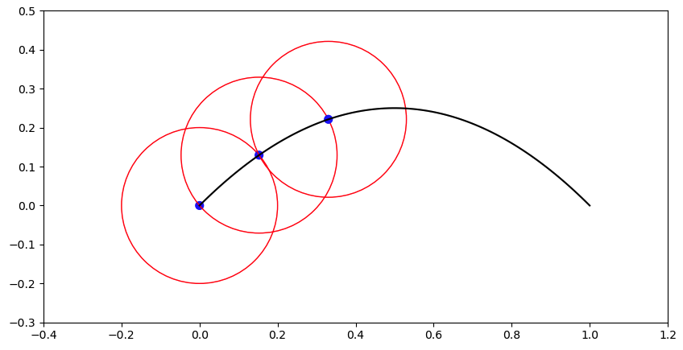
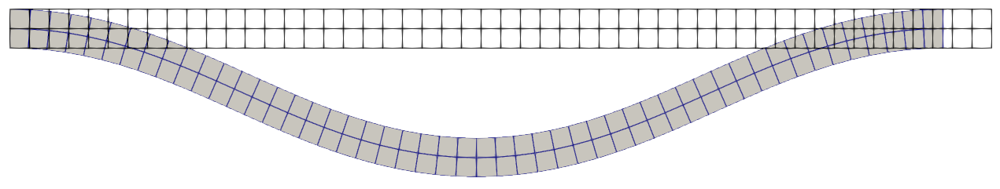
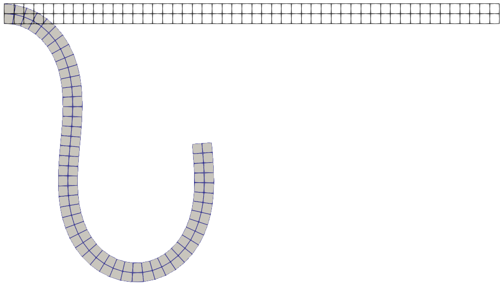

# Arc-length methods

## Overview

The Crisfield arc-length method treats the load factor $\lambda$ as an
additional unknown, allowing nonlinear equilibrium paths to be traced through
limit points and buckling instabilities.

| File | Control | Purpose |
| --- | --- | --- |
| `demo_analytical.py` | Force | Illustrates the continuation algorithm on a one-degree-of-freedom nonlinear equation. |
| `beam2d_displacement.py` | Displacement | Compresses a hyperelastic beam by scaling its prescribed right-edge displacement. |
| `beam2d_force.py` | Force | Loads a hyperelastic beam by scaling a traction applied to its right edge. |
| `hyperelastic_models.py` | — | Defines the shared mesh and Neo-Hookean material model for the beam examples. |

## Formulation

For displacement control,
$\boldsymbol{u}_D(\lambda)=\lambda\bar{\boldsymbol{u}}_D$, with the constraint

$$
\lVert\Delta\boldsymbol{u}\rVert^2
+\psi^2\Delta\lambda^2\lVert\boldsymbol{u}_b\rVert^2
=\Delta l^2,
$$

where $\boldsymbol{u}_b$ contains the full prescribed displacements.

Force control keeps the main `Problem` unchanged. Write its residual as

$$
\boldsymbol{R}_{\mathrm{main}}(\boldsymbol{u})
=\boldsymbol{R}_0(\boldsymbol{u})+\boldsymbol{q}_{\mathrm{target}},
$$

`BeamCounterLoad` has zero internal stress and the opposite target surface
term, so `get_q_vec` gives

$$
\boldsymbol{q}_{\mathrm{aux}}=-\boldsymbol{q}_{\mathrm{target}}.
$$

After zeroing its Dirichlet rows, the continuation residual becomes

$$
\boldsymbol{R}_{\mathrm{main}}(\boldsymbol{u})
+(1-\lambda)\boldsymbol{q}_{\mathrm{aux}}=\boldsymbol{0},
$$

or, equivalently,

$$
\boldsymbol{R}_0(\boldsymbol{u})
+\lambda\boldsymbol{q}_{\mathrm{target}}=\boldsymbol{0}.
$$

At $\lambda=0$, only the target right-edge load is canceled; the imperfection
load in $\boldsymbol{R}_0$ remains active. At $\lambda=1$, the counter-load
vanishes and the original main problem is recovered. The constraint is

$$
\lVert\Delta\boldsymbol{u}\rVert^2
+\psi^2\Delta\lambda^2\lVert\boldsymbol{q}_{\mathrm{aux}}\rVert^2
=\Delta l^2.
$$

The quadratic root most consistent with the previous increment is selected.
After continuation reaches $\lambda\geq 1$, a standard Newton solve uses the
continuation solution as its initial guess and polishes the original problem at
exactly $\lambda=1$.

## Execution

Run from the `jax-fem/` directory.

The one-degree-of-freedom example solves
$f_{\mathrm{int}}(u)=-u^2+u=\lambda$:

```bash
python -m applications.arc_length.demo_analytical
```

For displacement control, the left edge is clamped and the right edge is
prescribed $\bar{u}_x=-2.5$, $\bar{u}_y=0$:

```bash
python -m applications.arc_length.beam2d_displacement
```

For force control, the left edge is clamped and a compressive end load of
magnitude $5.0$ is applied:

```bash
python -m applications.arc_length.beam2d_force
```

Both beam examples use a small transverse imperfection load to select a
buckling branch and save one VTU file every ten continuation steps:

```text
applications/arc_length/output/arc_length_displacement/
applications/arc_length/output/arc_length_force/
```

## Expected results

| Example | End of continuation (before polish) | Newton polish and returned solution |
| --- | --- | --- |
| Displacement control | $\lambda=1.000554$ after 555 steps | Solves the original problem with the exact right-edge displacement $u_x=-2.5$; the polished solution has right-edge $u_y=0$ and $\max\lvert u_y\rvert\approx6.6402$. |
| Force control | $\lambda=1.001729$ after 512 steps | Solves the original main problem with the full target end load and no counter-load; the polished solution has $\max\lvert u_y\rvert\approx26.1848$. |

`info["lam"]` and the VTU files describe continuation before polish. The
returned `sol_list` and terminal `final solution` are the polished solution by the Newton's method at the exact target where $\lambda=1$.

<p align="center">
  
  <br />
  <em>Analytical equilibrium path and arc-length constraints.</em>
</p>

<p align="center">
  
  <br />
  <em>Displacement-controlled buckling: undeformed and deformed meshes.</em>
</p>

<p align="center">
  
  <br />
  <em>Force-controlled buckling: undeformed and deformed meshes.</em>
</p>

## Main parameters

- `control`: required; either `"displacement"` or `"force"`.
- `Delta_l`, `psi`: arc length and load-factor weighting.
- `max_continuation_steps`: maximum number of accepted continuation steps.
- `q_vec_aux`: force-control counter-load vector generated by `get_q_vec`.
- `Delta_l_late` and `Delta_l_switch_step`: optional force-control settings
  for changing the arc length.
- `step_callback`: callback for progress reporting or intermediate output.
- `return_info`: return continuation history and polish status.

## References

1. M. A. Crisfield, “A fast incremental/iterative solution procedure that
   handles ‘snap-through’,” *Computers & Structures*, 13(1–3), 55–62, 1981.
   [doi:10.1016/0045-7949(81)90108-5](https://doi.org/10.1016/0045-7949(81)90108-5)
2. N. Vasios, [“Nonlinear Analysis of Structures: The Arc Length Method —
   Formulation, Implementation and Applications,”](https://vasios.me/the-arc-length-method)
   2015.
3. The analytical script follows the MATLAB example
   [Demonstrations of Newton-Raphson Method and Arc-Length Method](https://www.mathworks.com/matlabcentral/fileexchange/48643-demonstrations-of-newton-raphson-method-and-arc-length-method).
