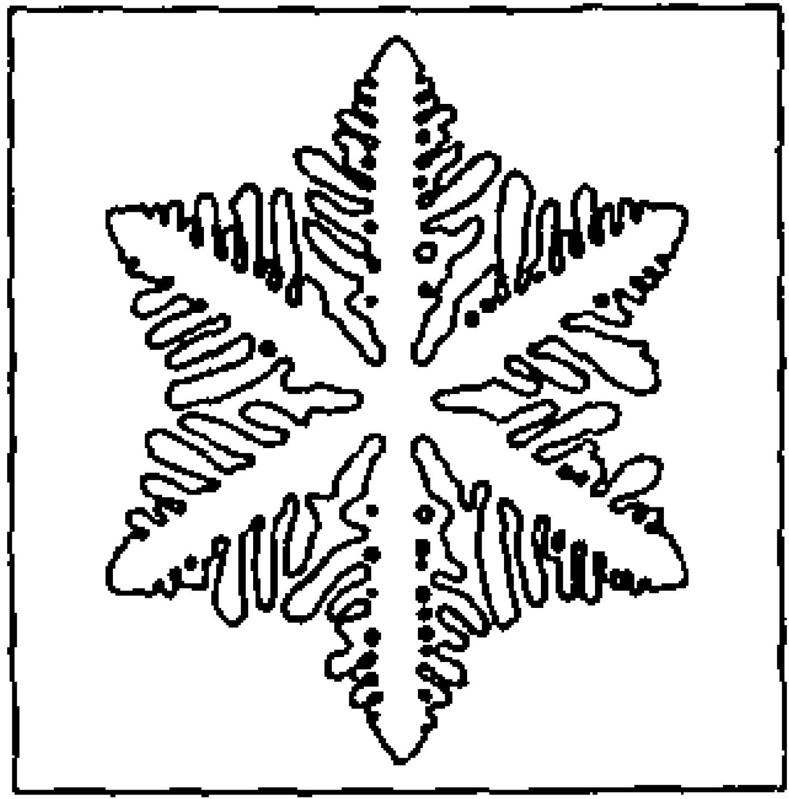

# Phase field method for dendrite growth

## Background

This example implements both **implicit finite element method** and **explicit finite element method** to solve the dendrite growth problem in the phase field framework. We compare our results with an explicit finite difference code by [1] and the result from the original paper [2].

## Results

  
  

  
  

    <em >Implicit finite element (top left); Explicit finite element (top right)</em>

    <em >Explicit finite difference (bottom left); Kobayashi paper (bottom right)</em>

## References

[1] https://drzgan.github.io/Python_CFD/Konayashi_1993-main/jax_version/kobayashi_aniso_jax_ZGAN-2.html

[2] Kobayashi, Ryo. "Modeling and numerical simulations of dendritic crystal growth." Physica D: Nonlinear Phenomena 63, no. 3-4 (1993): 410-423.

