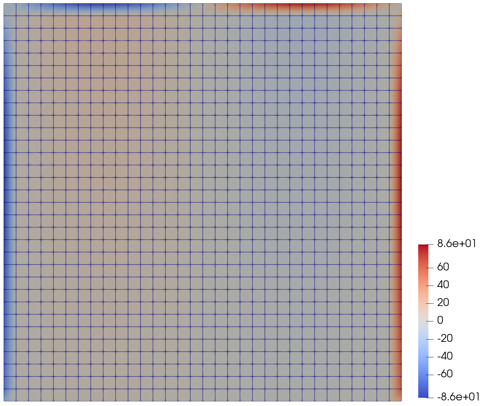
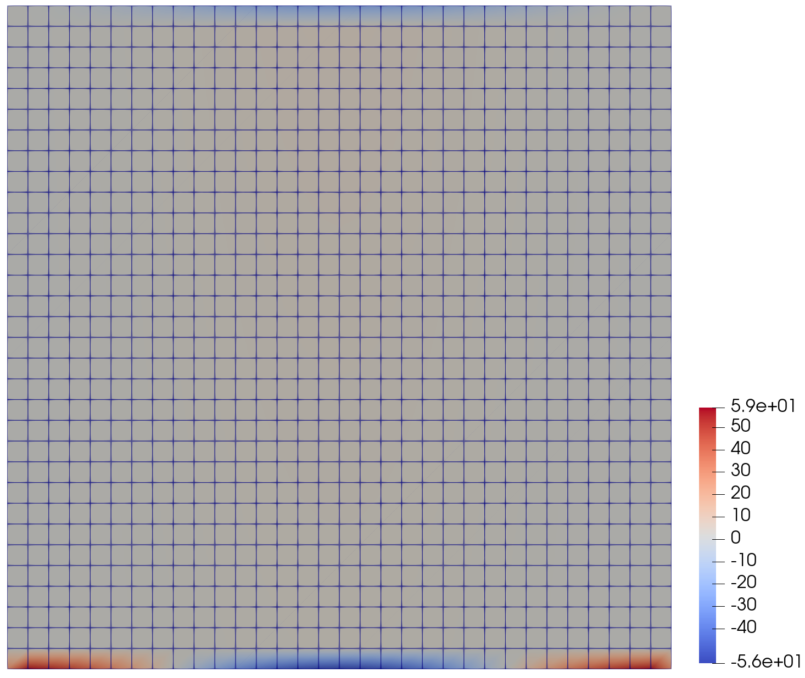

# Differentiable mesh (nodal-coordinate derivatives)


This example shows how **JAX-FEM** can differentiate a scalar **objective** with respect to **nodal coordinates** $\mathbf{X}\in\mathbb{R}^{N\times d}$ of the mesh. The implementation uses **`ad_wrapper`** (implicit adjoint through the nonlinear solve). A small **gold finite-difference** check on two independent meshes is provided for one scalar component of $\partial J/\partial \mathbf{X}$.

---

## Problem (nonlinear Poisson on the unit square)

On $\Omega=(0,1)^2$, consider governing equation

$$
-\nabla^2 u + u^3 = g \quad \text{in }\Omega,
$$

with weak form: find $u$ such that for all test functions $v$,

$$
\int_\Omega \nabla u\cdot\nabla v \,\mathrm{d}\Omega
+ \int_\Omega u^3 v \,\mathrm{d}\Omega
= \int_\Omega g v \,\mathrm{d}\Omega.
$$

We use a **manufactured** smooth solution

$$
u_{\mathrm{exact}}(x,y)=\sin(\pi x)\,(1+y),
$$

so that the source $g$ is chosen consistently (see `NonlinearPoisson.get_mass_map` in `example.py`). On the bottom edge $y=0$,

$$
u_{\mathrm{exact}}(x,0)=\sin(\pi x)\neq 0
\quad\text{(except at corners)},
$$

which makes the bottom nodes important (we will select one node at the bottom side to compare JAX-FEM with finite difference approach).

### Boundary conditions

- **Dirichlet:** $u=0$ on $x=0$ and $x=1$; $u=2\sin(\pi x)$ on $y=1$ (matching $u_{\mathrm{exact}}$).
- **Neumann** on $y=0$: outward normal $\mathbf{n}=(0,-1)$, flux data consistent with $u_{\mathrm{exact}}$ (implemented as the surface map in `get_surface_maps`).

---

## Objective and mesh sensitivity

Let $\mathbf{u}_h(\mathbf{X})$ be the discrete FEM solution (nodal values) obtained after solving the nonlinear system for fixed $\mathbf{X}$. Write $u_{h,i}$ for the scalar finite-element value at node $i$ (each $u_{h,i}$ depends on the full coordinate matrix $\mathbf{X}$). We define the scalar objective

$$
J(\mathbf{X}) = \sum_{i=1}^{N} u_{h,i}^2,
$$

i.e. the sum of squared nodal values. The quantity of interest for **shape / mesh sensitivity** is the **gradient** $\partial J/\partial \mathbf{X}$, a tensor of the same shape as $\mathbf{X}$, i.e. $(N,d)$. Its entries are the partial derivatives $\partial J/\partial X_{i,\alpha}$ for node index $i$ and spatial component index $\alpha\in\{1,\ldots,d\}$ (in 2D, $\alpha=1,2$ are the two nodal coordinate directions; the VTK field `dJ_dxy` stores these two components per node).

- **Automatic differentiation (AD):** `jax.value_and_grad` on a forward map that takes nodal positions $\mathbf{X}$, wrapped with `ad_wrapper(problem)`, returns $\partial J/\partial \mathbf{X}$ together with $J$ and the primal solution.
- **Gold finite difference (FD):** `finite_difference.py` builds two **new** `Mesh` / `Problem` instances, perturbs one chosen node by $\pm\varepsilon$ along one axis, solves each side with the standard `solver`, and forms a central difference for $\partial J/\partial X_{i,\alpha}$ at that $(i,\alpha)$. This is a reference for the **same** scalar partial derivative (subject to nonlinear solver noise when $\varepsilon$ is small).

The script checks that the **number of Neumann faces** is unchanged under the FD perturbation; otherwise AD and FD would not be comparable (topology of the Neumann set can jump if the perturbation crosses the boundary-classification tolerance).

---

## Files in this folder

| File | Role |
|------|------|
| `example.py` | Full driver: mesh, BCs, `ad_wrapper`, `value_and_grad`, gold FD, VTK export. |
| `finite_difference.py` | `gold_fd_two_independent_problems`: two independent solves, central difference. |
| `images/X.png`, `images/Y.png` | Screenshots of $\partial J/\partial X_{\cdot,1}$ and $\partial J/\partial X_{\cdot,2}$ in ParaView (side by side below). |

---

## Running the example

From the **repository root** (so that `applications` and `jax_fem` resolve):

```bash
python -m applications.differentiable_mesh.example
```

Outputs:

- Console: discrete error $\lVert u_h-u_{\mathrm{exact}}\rVert_\infty$ and a one-line comparison of AD vs gold FD for the chosen perturbation.
- `applications/differentiable_mesh/output/vtk/u.vtu`: solution, exact field, absolute error, and **`dJ_dxy`** (per node $i$: components $\partial J/\partial X_{i,1}$ and $\partial J/\partial X_{i,2}$).

Open the VTU in **ParaView**, color by the first or second component of `dJ_dxy` (or split vectors). Results similar to:

<table>
  <tr>
    <td width="50%" valign="top" align="center"><strong>∂J/∂X<sub>·,1</sub></strong> (1st component of <code>dJ_dxy</code>)<br/></td>
    <td width="50%" valign="top" align="center"><strong>∂J/∂X<sub>·,2</sub></strong> (2nd component of <code>dJ_dxy</code>)<br/></td>
  </tr>
</table>

The patterns reflect how moving each boundary/interior node affects the discrete energy $\sum_i u_{h,i}^2$ through the finite element procedures.

