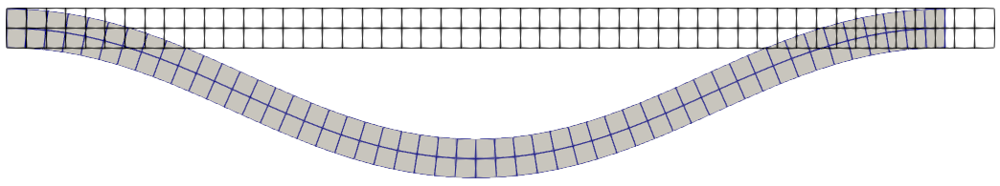
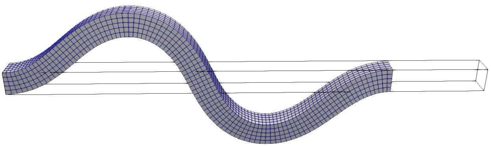
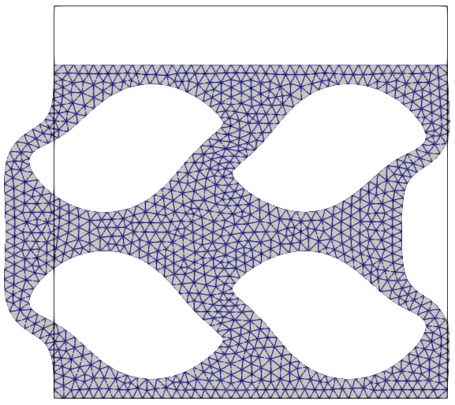

# Dynamic relaxation

## Overview

Dynamic relaxation introduces fictitious inertia and damping and marches the
finite-element residual toward a static equilibrium. It avoids a full nonlinear
solve at every iteration and is particularly useful for large-deformation and
buckling problems for which a conventional Newton iteration may be difficult to
initialize.

| File | Model | Purpose |
| --- | --- | --- |
| `beam2d_displacement.py` | 2D hyperelastic beam | Demonstrates displacement-controlled buckling and compares solutions with and without a small branch-selecting transverse load. |
| `beam3d_displacement.py` | 3D hyperelastic beam | Compresses a slender solid beam with a small transverse end displacement to select its buckling direction. |
| `cellular_displacement.py` | 2D hyperelastic cellular solid | Compresses an imported quadratic-triangle mesh by prescribing the displacement of its top edge. |

## Formulation

For a static finite-element residual
$\boldsymbol{R}(\boldsymbol{q})=\boldsymbol{0}$, dynamic relaxation introduces
fictitious inertia and damping:

```math
\boldsymbol{M}\ddot{\boldsymbol{q}}
+c\boldsymbol{M}\dot{\boldsymbol{q}}
+\boldsymbol{R}(\boldsymbol{q})=\boldsymbol{0}.
```

Here, $\boldsymbol{q}$ is the displacement, $\boldsymbol{M}$ is a diagonal
artificial mass matrix, and $c$ is an adaptive damping coefficient. These
quantities control the convergence path rather than a physical transient
response.

The artificial mass is estimated from the absolute row sums of the tangent
matrix $\boldsymbol{K}$:

```math
M_i=\frac{\tilde{h}^2}{4}\sum_j\lvert K_{ij}\rvert,
\qquad \tilde{h}=1.1.
```

The solution is advanced by a central-difference update with adaptive damping.
The tangent matrix and artificial mass are updated periodically when the local
stiffness changes sufficiently. Convergence is reached when the residual over
the free degrees of freedom satisfies

```math
\lVert\boldsymbol{R}\rVert_\infty\leq\mathtt{tol}.
```

## Execution

Run from the `jax-fem/` directory.

The 2D example uses a $50\times2$ `QUAD4` mesh of a $50\times2$ beam. Both ends
have zero transverse displacement, the left end is fixed, and the right end is
compressed by $u_x=-2.5$:

```bash
python -m applications.dynamic_relaxation.beam2d_displacement
```

It first uses a very small upward load near the bottom midspan to select a
buckling branch. The auxiliary solve removes that load and starts from the
first solution to verify the same unloaded buckled equilibrium.

The 3D example uses a $100\times5\times5$ `HEX8` mesh of a $20\times1\times1$
beam. Its right end is prescribed $u_x=-4$, $u_y=0.005$, and $u_z=0$:

```bash
python -m applications.dynamic_relaxation.beam3d_displacement
```

This example generates its mesh with Gmsh and therefore requires a working
Gmsh installation.

The cellular-solid example reads
`input/abaqus/cellular_solid.inp`, fixes its bottom edge, and moves its top edge
downward by $15\%$ of the specimen height:

```bash
python -m applications.dynamic_relaxation.cellular_displacement
```

The results are written to:

```text
applications/dynamic_relaxation/output/beam2d/
applications/dynamic_relaxation/output/beam3d/
applications/dynamic_relaxation/output/cellular_solid/
```

## Expected results

| Example | Output | Expected behavior |
| --- | --- | --- |
| 2D beam | `u.vtu`, `u_aux.vtu` | The small transverse load selects a strongly buckled branch with $\max\lvert u_y\rvert\approx6.640192$. The auxiliary solve removes that load and starts from the first solution; it remains on the same branch with $\max\lvert u_y\rvert\approx6.640191$. |
| 3D beam | `u.vtu` | The compressed beam buckles primarily in the $y$ direction; the saved result has approximately $-2.5436\leq u_y\leq2.5486$. |
| Cellular solid | `mesh.vtu`, `u_001.vtu` | The cell walls deform and buckle under vertical compression; `mesh.vtu` contains the undeformed imported mesh and `u_001.vtu` contains the displacement solution. |

The numerical extrema above correspond to the example meshes and parameters in
the repository and can vary slightly with precision, dependency versions, or
solver changes.

<p align="center">
  
  <br />
  <em>2D beam buckling with and without the small branch-selecting load.</em>
</p>

<p align="center">
  
  <br />
  <em>Displacement-controlled buckling of the 3D hyperelastic beam.</em>
</p>

<p align="center">
  
  <br />
  <em>Cellular solid before and after vertical compression.</em>
</p>

## Main parameters

- `tol`: absolute infinity-norm residual tolerance; default `1e-6`.
- `nKMat`: minimum number of relaxation iterations between eligible tangent
  matrix and artificial-mass updates; default `1000`.
- `nPrint`: interval for detailed damping, velocity, and acceleration output;
  default `500`.
- `info`: enables detailed dynamic-relaxation diagnostics and tangent-refresh
  messages; default `True`.
- `info_force`: enables periodic residual and maximum-velocity output; default
  `True`.
- `initial_guess`: optional solution pytree used to initialize the relaxation.
- `linear`: linear-solver options used for the initial linearized step; the
  dynamic-relaxation default is the SciPy sparse direct solver.

A typical configuration is:

```python
solver_options = {
    'dynamic_relax': {
        'tol': 1e-8,
        'nKMat': 1000,
        'nPrint': 500,
        'linear': {'spsolve_solver': {}},
    },
}
sol_list = solver(problem, solver_options)
```

Dynamic relaxation currently does not support periodic boundary conditions.
The implementation also has no iteration-count cutoff, so an unsuitable model,
singular artificial mass, or unreachable tolerance may continue iterating.

The tangent matrix and artificial mass are refreshed when the stiffness-change
indicator `eps` exceeds its threshold and more than `nKMat` iterations have
elapsed since the previous refresh.

## Reference

1. D. J. Luet, *Bounding Volume Hierarchy and Non-Uniform Rational B-Splines
   for Contact Enforcement in Large Deformation Finite Element Analysis of
   Sheet Metal Forming*, Ph.D. dissertation, Princeton University, 2016,
   Chapter 4.3, “Nonlinear System Solution.”
