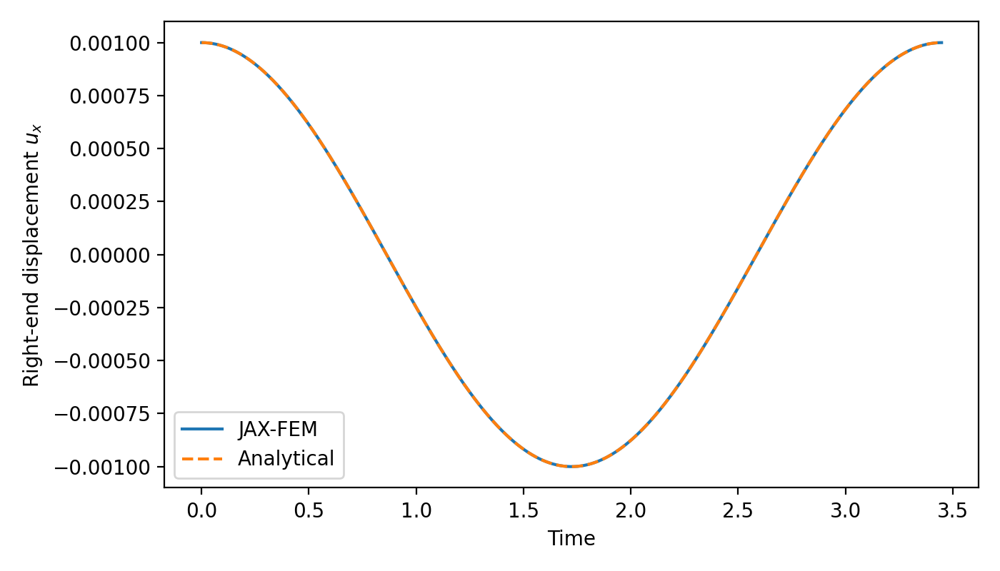
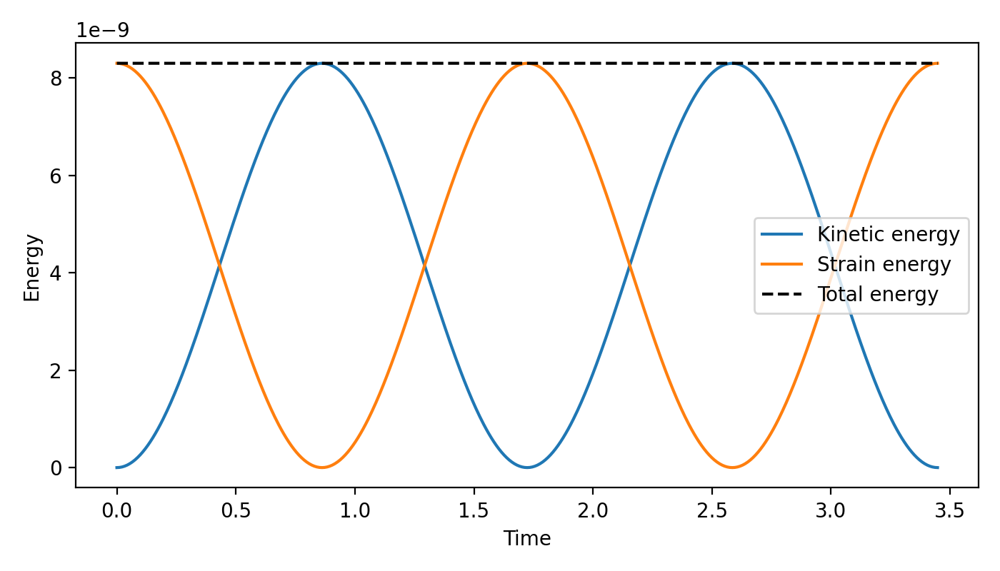

# Explicit dynamics of a 3D elastic waveguide

## Overview

This minimum example solves the free vibration of a three-dimensional elastic
waveguide using lumped mass and the explicit central-difference method. It uses
an `80 x 2 x 2` `HEX8` mesh (320 elements and 2187 displacement degrees of
freedom). During time stepping, JAX-FEM evaluates the internal force but does
not assemble or solve a global linear system.

The example is kept in a single Python file. The main parameters are grouped at
the beginning of `main()` so the mesh, material, CFL number, and VTK output
interval can be changed directly.

## Governing equation

For small-strain isotropic elasticity,

```math
\rho\ddot{\boldsymbol u}=\nabla\cdot\boldsymbol\sigma,
\qquad
\boldsymbol\sigma=\lambda\,\mathrm{tr}(\boldsymbol\varepsilon)\boldsymbol I
+2\mu\boldsymbol\varepsilon,
\qquad
\boldsymbol\varepsilon=
\frac{1}{2}\left(\nabla\boldsymbol u+\nabla\boldsymbol u^T\right).
```

The domain is the rectangular waveguide

```math
\Omega=[0,L_x]\times[0,L_y]\times[0,L_z].
```

The boundary conditions are:

- `u_x=0` on the left end `x=0`;
- `u_y=0` on the two faces `y=0` and `y=L_y`;
- `u_z=0` on the two faces `z=0` and `z=L_z`;
- the right end `x=L_x` is traction-free.

There are no body forces or surface loads. The object moves because it is
released from a nonzero initial displacement with zero initial velocity:

```math
u_x(x,0)=A\sin\left(\frac{\pi x}{2L_x}\right),
\qquad
\dot{\boldsymbol u}(x,0)=\boldsymbol 0.
```

The initial elastic strain energy is converted into kinetic energy, producing
an undamped free vibration.

## Analytical solution

The lateral displacement constraints suppress transverse deformation and
produce a pure plane-strain longitudinal P wave. The first fixed-free mode has
the exact solution

```math
u_x(x,t)=A\sin(kx)\cos(c_p k t),
\qquad
k=\frac{\pi}{2L_x},
```

where

```math
c_p=\sqrt{\frac{\lambda+2\mu}{\rho}}
=\sqrt{\frac{E(1-\nu)}{(1+\nu)(1-2\nu)\rho}},
\qquad
T=\frac{4L_x}{c_p}.
```

This particular choice provides an exact solution while still exercising a
three-dimensional mesh, three displacement components, and the full 3D
constitutive law. If all lateral faces are traction-free, Poisson deformation
and waveguide dispersion generally prevent this simple P-wave solution from
being exact.

## Mass lumping and time integration

Starting from the consistent element mass

```math
M^e_{ij}=\int_{\Omega_e}\rho N_iN_j\,d\Omega,
```

row-sum lumping and the partition of unity give

```math
m_i^e=\sum_jM^e_{ij}=\int_{\Omega_e}\rho N_i\,d\Omega.
```

The code evaluates this last expression directly. The resulting diagonal mass
matrix makes the acceleration an element-wise division:

```math
\ddot{\boldsymbol u}^n
=-\boldsymbol M_L^{-1}\boldsymbol f_{\mathrm{int}}(\boldsymbol u^n).
```

Displacement is advanced with the central-difference formula

```math
\boldsymbol u^{n+1}=2\boldsymbol u^n-\boldsymbol u^{n-1}
-\Delta t^2\boldsymbol M_L^{-1}
\boldsymbol f_{\mathrm{int}}(\boldsymbol u^n).
```

The fictitious previous state is initialized to second order:

```math
\boldsymbol u^{-1}=\boldsymbol u^0-\Delta t\boldsymbol v^0
+\frac{1}{2}\Delta t^2\boldsymbol a^0.
```

The complete time loop is executed by `jax.lax.scan`. The default time step is
based on the smallest element dimension and the theoretical P-wave speed with
`CFL=0.5`. This estimate is appropriate for this regular verification mesh;
more general distorted or nonlinear meshes require a more careful critical
time-step estimate.

## Run and expected result

Run from the repository root:

```bash
python -m applications.explicit_dynamics.example
```

The default calculation advances one analytical period and reports
approximately:

```text
Theoretical P-wave speed = 1.16023870
Measured P-wave speed    = 1.16022513
Relative speed error     = 1.170e-05
Maximum normalized L2 error over one period = 6.051e-05
```

The numerical wave speed is obtained from the first zero crossing of the
mass-weighted modal displacement. It is therefore measured from the numerical
history rather than copied from the analytical value.

<p align="center">
  
  <br />
  <em>Longitudinal displacement at the center of the free end.</em>
</p>

The example also evaluates the kinetic energy

```math
K=\frac{1}{2}\dot{\boldsymbol u}^{T}\boldsymbol M_L\dot{\boldsymbol u}
```

and the elastic strain energy

```math
U=\int_\Omega\left[
\frac{\lambda}{2}\mathrm{tr}(\boldsymbol\varepsilon)^2
+\mu\boldsymbol\varepsilon:\boldsymbol\varepsilon\right]d\Omega.
```

With no external force or damping, their sum should remain nearly constant as
the kinetic and strain energies exchange during the vibration.

<p align="center">
  
  <br />
  <em>Exchange of kinetic and strain energy; their sum remains nearly constant.</em>
</p>

<p align="center">
  <video src="assets/test.mp4" controls width="700"></video>
  <br />
  <em>One period of the longitudinal free vibration.</em>
</p>
