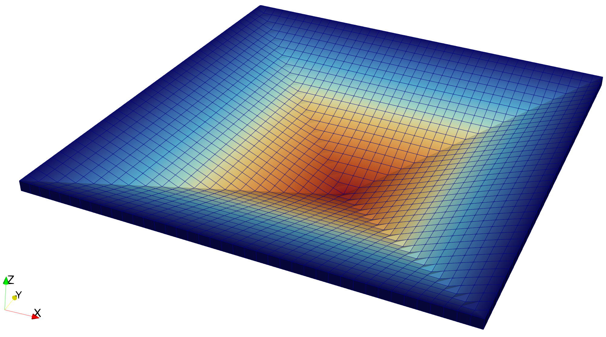

# Finite-strain plasticity

## Overview

This directory contains a three-dimensional finite-strain $J_2$ plasticity
model with linear isotropic hardening and two applications that use it. The
examples exercise finite-deformation constitutive updates, but they do not
model contact with tools or carry a workpiece through a forming process.

| File | Purpose |
| --- | --- |
| `model.py` | Defines the shared constitutive update, internal-variable update, and Cauchy-stress post-processing. |
| `single_cell.py` | Loads and unloads one `HEX8` element in uniaxial tension. |
| `thin_plate.py` | Applies a prescribed bowl-shaped displacement to a thin `HEX8` plate and then unloads it. |

## Constitutive model

The model uses the multiplicative decomposition
$\boldsymbol{F}=\boldsymbol{F}_e\boldsymbol{F}_p$ with isochoric plastic
flow. Its quadrature-point history is the previous total deformation gradient
$\boldsymbol{F}_n$, the isochoric elastic left Cauchy--Green tensor
$\bar{\boldsymbol{b}}_{e,n}$, and the accumulated plastic strain $\alpha_n$
[1,2].

For a new total deformation gradient $\boldsymbol{F}_{n+1}$, the elastic
predictor is

```math
\boldsymbol{f}_{n+1}=\boldsymbol{F}_{n+1}\boldsymbol{F}_n^{-1},
\qquad
\bar{\boldsymbol{f}}_{n+1}
=\det(\boldsymbol{f}_{n+1})^{-1/3}\boldsymbol{f}_{n+1},
```

```math
\bar{\boldsymbol{b}}_{e,n+1}^{\mathrm{trial}}
=\bar{\boldsymbol{f}}_{n+1}\bar{\boldsymbol{b}}_{e,n}
 \bar{\boldsymbol{f}}_{n+1}^{T}.
```

Using $G$ for the shear modulus, the trial deviatoric Kirchhoff stress and
yield function are

```math
\boldsymbol{s}^{\mathrm{trial}}
=G\,\mathrm{dev}(\bar{\boldsymbol{b}}_e^{\mathrm{trial}}),
\qquad
\phi^{\mathrm{trial}}
=\lVert\boldsymbol{s}^{\mathrm{trial}}\rVert
-\sqrt{\frac{2}{3}}\left(\sigma_0+H\alpha_n\right).
```

If $\phi^{\mathrm{trial}}>0$, the radial return algorithm in [1] gives

```math
\bar G=\frac{G}{3}\mathrm{tr}
(\bar{\boldsymbol{b}}_e^{\mathrm{trial}}),
\qquad
\Delta\gamma
=\frac{\phi^{\mathrm{trial}}}
{2\bar G\left(1+H/(3\bar G)\right)},
\qquad
\alpha_{n+1}=\alpha_n+\sqrt{\frac{2}{3}}\Delta\gamma.
```

The Kirchhoff, first Piola--Kirchhoff, and Cauchy stresses are

```math
\boldsymbol{\tau}
=\frac{K}{2}(J^2-1)\boldsymbol{I}+\boldsymbol{s},
\qquad
\boldsymbol{P}=\boldsymbol{\tau}\boldsymbol{F}^{-T},
\qquad
\boldsymbol{\sigma}=J^{-1}\boldsymbol{\tau}.
```

The use of $\bar{\boldsymbol{f}}$ in the trial state is essential: the stored
$\bar{\boldsymbol{b}}_e$ is isochoric, so a purely volumetric relative change
must not rescale its deviatoric stress [1].

The demonstration parameters are:

| Parameter | Value | Role |
| --- | ---: | --- |
| $K$ | $164000$ | Bulk modulus |
| $G$ | $80000$ | Shear modulus |
| $\sigma_0$ | $400$ | Initial yield stress |
| $H$ | $18$ | Linear isotropic-hardening modulus |

All dimensional material values must use a consistent unit system.

## Applications

`single_cell.py` uses a unit cube with one `HEX8` element. The bottom and top
faces have prescribed vertical displacement, and the top displacement is
increased to $0.01$ before unloading to zero. The lateral faces are
traction-free; point constraints remove the remaining rigid-body modes.

`thin_plate.py` uses a $10\times10\times0.25$ plate with a
$40\times40\times1$ `HEX8` mesh. Its four side faces are fixed, while a
spatially varying downward displacement is prescribed on the top face. The
loading reaches a center displacement of approximately $-2$ and then returns
to zero. This problem uses the Newton line search to improve convergence.

## Inputs and outputs

There are no checked-in simulation inputs. Both meshes are generated with
Gmsh when the applications start, so the mesh files are outputs rather than
inputs. Each example owns a separate output directory:

```text
output/
├── single_cell/
│   ├── msh/box.msh
│   └── vtk/u_000.vtu ... u_021.vtu
└── thin_plate/
    ├── msh/box.msh
    └── vtk/u_000.vtu ... u_009.vtu
```

The output directory is ignored by Git. Existing VTU files for the selected
example are cleared at the beginning of a run; the other example's results are
left untouched.

## Execution

Run from the `jax-fem/` directory. A working Gmsh installation is required.

```bash
python -m applications.finite_plasticity.single_cell
python -m applications.finite_plasticity.thin_plate
```

The single-cell result should show yielding during loading and residual plastic
strain after unloading. The thin plate should deform into a bowl-shaped
configuration like the field shown below; the saved cell field `s_norm` is the
Frobenius norm of the Cauchy stress.

| Example | Expected behavior |
| --- | --- |
| Single cell | The maximum accumulated plastic strain is approximately `0.008031` at peak tension and `0.014091` after reverse yielding during unloading. |
| Thin plate | The plate reaches the prescribed bowl shape at maximum loading; the maximum accumulated plastic strain is approximately `0.371922` there and `0.830404` after the complete reverse-loading path. |

These values correspond to the supplied meshes, increments, and material
parameters and can vary slightly with precision or solver versions.

<p align="center">
  
  <br />
  <em>Thin plate under the prescribed bowl-shaped displacement.</em>
</p>

## Current limitations

- The line search is a problem-specific step-halving heuristic. It tests only
  $\alpha\in\{1,1/2,1/4,1/8\}$, does not compare against the residual at
  $\alpha=0$, and imposes no Armijo-type sufficient-decrease condition. It can
  therefore accept a step that does not reduce the current residual.
- The closed-form backward-Euler radial return satisfies the discrete yield
  condition but does not enforce $\det(\bar{\boldsymbol{b}}_e)=1$ exactly after
  every plastic correction. An exponential-map or constraint-conforming
  update is needed when exact discrete plastic incompressibility is required
  [2,3].

## References

[1] Simo, Juan C., and Thomas J. R. Hughes. *Computational Inelasticity*.
Interdisciplinary Applied Mathematics, vol. 7. Springer, 1998.

[2] Simo, Juan C. "Algorithms for static and dynamic multiplicative plasticity
that preserve the classical return mapping schemes of the infinitesimal
theory." *Computer Methods in Applied Mechanics and Engineering* 99.1 (1992):
61-112. [doi:10.1016/0045-7825(92)90123-2](https://doi.org/10.1016/0045-7825(92)90123-2)

[3] Bode, Tobias, Meisam Soleimani, Cem Erdogan, Klaus Hackl, Peter Wriggers,
and Philipp Junker. "On constraint-conforming numerical discretizations in
constitutive material modeling." *Computational Mechanics* 75.3 (2025):
1015-1031. [doi:10.1007/s00466-024-02548-3](https://doi.org/10.1007/s00466-024-02548-3)
