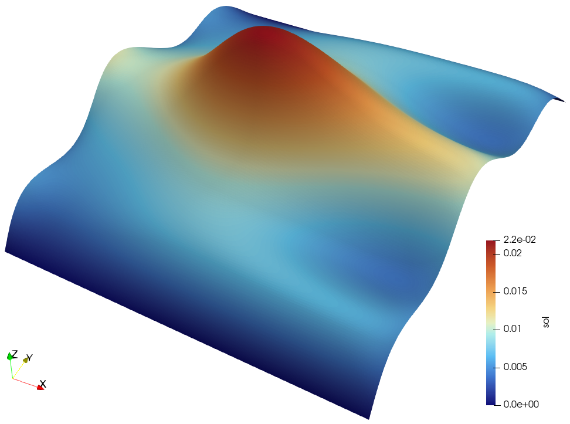

# Periodic boundary conditions

## Overview

This example solves a scalar Poisson problem on the unit square with periodic
boundary conditions in the $x$ direction. The left boundary is used as the
master side and the right boundary is constrained to it through a linear
multipoint constraint matrix `P_mat`.

| File | Purpose |
| --- | --- |
| `example.py` | Builds a quadratic triangular mesh, constructs `P_mat`, solves the periodic Poisson problem, writes a VTU file, and checks implicit differentiation. |
| `fenics.py` | Reference FEniCS implementation of the same periodic-boundary setup. |

The forward solution is saved to

```text
applications/periodic_bc/data/vtk/u.vtu
```

The VTU file stores the mesh coordinates as `(x, y, 0)` and writes the solution
as the active point scalar `sol`, so it can be used directly with ParaView
filters such as `Warp By Scalar`.

## Problem

The example solves

```math
-\nabla\cdot(\theta\nabla u)=f
\quad\mathrm{in}\quad \Omega=(0,1)^2,
```

with homogeneous Dirichlet boundary conditions on the bottom and top edges,

```math
u(x,0)=u(x,1)=0,
```

and periodicity between the left and right edges,

```math
u(0,y)=u(1,y).
```

The source term is

```math
f(x,y)=x\sin(5\pi y)
+\exp\left(-\frac{(x-0.5)^2+(y-0.5)^2}{0.02}\right).
```

The material parameter `theta` is treated as the differentiable scalar
parameter in the AD check.

## Periodic constraint

Let `u_full` be the full vector of nodal degrees of freedom and `u_red` be the
reduced vector after eliminating duplicate periodic degrees of freedom. The
periodic constraint is represented as

```math
\boldsymbol{u}_{\mathrm{full}}
=\boldsymbol{P}\boldsymbol{u}_{\mathrm{red}}.
```

Here `P_mat` has shape `(N, M)`, where `N` is the number of full DOFs before
applying periodic constraints and `M` is the number of independent DOFs after
removing the slave periodic DOFs. Therefore `N >= M`; in this example `N > M`
because every constrained right-boundary DOF shares an unknown with a
corresponding left-boundary DOF. Multiplying by `P_mat` expands a reduced vector
to the full mesh, while multiplying by `P_mat.T` gathers full-space residuals
or adjoint loads back to the independent reduced DOFs.

For this example, every right-boundary node is matched to the corresponding
left-boundary node shifted by

```math
(x,y)\mapsto(x+1,y).
```

`periodic_boundary_conditions` constructs `P_mat` by assigning the slave
right-boundary DOF to the same reduced column as its master left-boundary DOF.
The nonlinear residual and tangent are then assembled in reduced coordinates:

```math
\boldsymbol{R}_{\mathrm{red}}
=\boldsymbol{P}^{T}\boldsymbol{R}_{\mathrm{full}},
\qquad
\boldsymbol{K}_{\mathrm{red}}
=\boldsymbol{P}^{T}\boldsymbol{K}_{\mathrm{full}}\boldsymbol{P}.
```

Dirichlet rows are eliminated before applying the periodic projection.

## Toy problem

Consider a tiny non-FEM system with four full unknowns,

```math
\boldsymbol{u}_{\mathrm{full}}
=
\begin{bmatrix}
u_0 & u_1 & u_2 & u_3
\end{bmatrix}^{T},
```

and impose one periodic constraint:

```math
u_3=u_0.
```

Only three independent unknowns remain:

```math
\boldsymbol{u}_{\mathrm{red}}
=
\begin{bmatrix}
a & b & c
\end{bmatrix}^{T}.
```

The expansion matrix is

```math
\boldsymbol{P}
=
\begin{bmatrix}
1 & 0 & 0\\
0 & 1 & 0\\
0 & 0 & 1\\
1 & 0 & 0
\end{bmatrix},
\qquad
\boldsymbol{u}_{\mathrm{full}}
=
\boldsymbol{P}\boldsymbol{u}_{\mathrm{red}}
=
\begin{bmatrix}
a\\ b\\ c\\ a
\end{bmatrix}.
```

Thus `N = 4`, `M = 3`, and the slave DOF `u_3` reuses the same reduced column as
the master DOF `u_0`.

Suppose the full residual is

```math
\boldsymbol{R}_{\mathrm{full}}
(\boldsymbol{u},\theta)
=
\boldsymbol{K}_{\mathrm{full}}\boldsymbol{u}
-\theta\boldsymbol{f},
\qquad
\boldsymbol{K}_{\mathrm{full}}
=
\begin{bmatrix}
2 & -1 & 0 & 0\\
-1 & 2 & -1 & 0\\
0 & -1 & 2 & -1\\
0 & 0 & -1 & 2
\end{bmatrix},
\qquad
\boldsymbol{f}
=
\begin{bmatrix}
1\\0\\0\\1
\end{bmatrix}.
```

The reduced residual is

```math
\boldsymbol{R}_{\mathrm{red}}
=
\boldsymbol{P}^{T}
\boldsymbol{R}_{\mathrm{full}}
(\boldsymbol{P}\boldsymbol{u}_{\mathrm{red}},\theta)
=
\boldsymbol{K}_{\mathrm{red}}\boldsymbol{u}_{\mathrm{red}}
-\theta\boldsymbol{f}_{\mathrm{red}},
```

where

```math
\boldsymbol{K}_{\mathrm{red}}
=
\boldsymbol{P}^{T}\boldsymbol{K}_{\mathrm{full}}\boldsymbol{P}
=
\begin{bmatrix}
4 & -1 & -1\\
-1 & 2 & -1\\
-1 & -1 & 2
\end{bmatrix},
\qquad
\boldsymbol{f}_{\mathrm{red}}
=
\boldsymbol{P}^{T}\boldsymbol{f}
=
\begin{bmatrix}
2\\0\\0
\end{bmatrix}.
```

The first reduced residual component contains the sum of the master and slave
full residual entries. For example, if

```math
\boldsymbol{R}_{\mathrm{full}}
=
\begin{bmatrix}
R_0\\R_1\\R_2\\R_3
\end{bmatrix},
```

then

```math
\boldsymbol{P}^{T}\boldsymbol{R}_{\mathrm{full}}
=
\begin{bmatrix}
R_0+R_3\\R_1\\R_2
\end{bmatrix}.
```

At `theta = 1`, solving

```math
\boldsymbol{K}_{\mathrm{red}}\boldsymbol{u}_{\mathrm{red}}
=
\boldsymbol{f}_{\mathrm{red}}
```

gives

```math
\boldsymbol{u}_{\mathrm{red}}
=
\begin{bmatrix}
1\\1\\1
\end{bmatrix},
\qquad
\boldsymbol{u}_{\mathrm{full}}
=
\boldsymbol{P}\boldsymbol{u}_{\mathrm{red}}
=
\begin{bmatrix}
1\\1\\1\\1
\end{bmatrix}.
```

## Sensitivity in reduced coordinates

Let $\hat{\boldsymbol{u}}\in\mathbb{R}^{M}$ denote the independent reduced DOFs
and $\boldsymbol{u}\in\mathbb{R}^{N}$ denote the full DOFs. The forward solve
can be viewed as

```math
\boldsymbol{u}
=
\boldsymbol{P}\hat{\boldsymbol{u}},
\qquad
\boldsymbol{P}\in\mathbb{R}^{N\times M},
\qquad
N\ge M.
```

After applying periodic constraints, the full residual equation
$\boldsymbol{R}(\boldsymbol{u},\theta)=\boldsymbol{0}$ becomes the reduced
equation

```math
\boldsymbol{P}^{T}
\boldsymbol{R}
\left(\boldsymbol{P}\hat{\boldsymbol{u}},\theta\right)
=
\boldsymbol{0}.
```

Differentiating with respect to $\theta$ gives

```math
\boldsymbol{P}^{T}
\frac{\partial \boldsymbol{R}}{\partial \boldsymbol{u}}
\boldsymbol{P}
\frac{d\hat{\boldsymbol{u}}}{d\theta}
+
\boldsymbol{P}^{T}
\frac{\partial \boldsymbol{R}}{\partial \theta}
=
\boldsymbol{0}.
```

Therefore

```math
\frac{d\hat{\boldsymbol{u}}}{d\theta}
=
-
\left(
\boldsymbol{P}^{T}
\frac{\partial \boldsymbol{R}}{\partial \boldsymbol{u}}
\boldsymbol{P}
\right)^{-1}
\boldsymbol{P}^{T}
\frac{\partial \boldsymbol{R}}{\partial \theta}.
```

For an objective $J(\boldsymbol{u},\theta)$, write gradients of $J$ as row
vectors. The reduced and full gradients are related by

```math
\left(
\frac{\partial J}{\partial \hat{\boldsymbol{u}}}
\right)^{T}
=
\boldsymbol{P}^{T}
\left(
\frac{\partial J}{\partial \boldsymbol{u}}
\right)^{T}.
```

The adjoint variable $\boldsymbol{\lambda}\in\mathbb{R}^{M}$ is defined in the
reduced space:

```math
\left(
\boldsymbol{P}^{T}
\frac{\partial \boldsymbol{R}}{\partial \boldsymbol{u}}
\boldsymbol{P}
\right)^{T}
\boldsymbol{\lambda}
=
\left(
\frac{\partial J}{\partial \hat{\boldsymbol{u}}}
\right)^{T}.
```

Start from the chain rule in reduced coordinates:

```math
\frac{dJ}{d\theta}
=
\frac{\partial J}{\partial \theta}
+
\frac{\partial J}{\partial \hat{\boldsymbol{u}}}
\frac{d\hat{\boldsymbol{u}}}{d\theta}.
```

Using the adjoint definition,

```math
\frac{\partial J}{\partial \hat{\boldsymbol{u}}}
=
\boldsymbol{\lambda}^{T}
\left(
\boldsymbol{P}^{T}
\frac{\partial \boldsymbol{R}}{\partial \boldsymbol{u}}
\boldsymbol{P}
\right),
```

so

```math
\frac{dJ}{d\theta}
=
\frac{\partial J}{\partial \theta}
+
\boldsymbol{\lambda}^{T}
\left(
\boldsymbol{P}^{T}
\frac{\partial \boldsymbol{R}}{\partial \boldsymbol{u}}
\boldsymbol{P}
\right)
\frac{d\hat{\boldsymbol{u}}}{d\theta}.
```

The differentiated reduced residual gives

```math
\left(
\boldsymbol{P}^{T}
\frac{\partial \boldsymbol{R}}{\partial \boldsymbol{u}}
\boldsymbol{P}
\right)
\frac{d\hat{\boldsymbol{u}}}{d\theta}
=
-
\boldsymbol{P}^{T}
\frac{\partial \boldsymbol{R}}{\partial \theta}.
```

Substituting this into the chain rule gives

```math
\frac{dJ}{d\theta}
=
\frac{\partial J}{\partial \theta}
-
\boldsymbol{\lambda}^{T}
\boldsymbol{P}^{T}
\frac{\partial \boldsymbol{R}}{\partial \theta}.
```

The important point is that both the tangent solve and the adjoint solve live
in the reduced space. The full residual and full tangent are evaluated at
$\boldsymbol{u}=\boldsymbol{P}\hat{\boldsymbol{u}}$, and all right-hand sides
are gathered back with $\boldsymbol{P}^{T}$.

## Execution

Run from the `jax-fem/` directory:

```bash
python -m applications.periodic_bc.example
```

The script generates a Gmsh mesh, solves the forward problem, writes the VTU
solution, and prints a finite-difference versus automatic-differentiation check
for

```math
J(\theta)=\sum_i u_i(\theta)^2.
```

For derivative verification, prefer a direct linear solve such as
`spsolve_solver`, or PETSc with `ksp_type="preonly"` and `pc_type="lu"`.
Default iterative PETSc settings can leave a small forward-solve error that is
amplified by the finite-difference quotient.

## Expected results

With a direct sparse solve, the finite-difference and adjoint sensitivities
agree near

```text
Finite difference:         -7.5000
Automatic differentiation: -7.5000
```

Small variations are expected from mesh regeneration and finite-difference
step size. If the default iterative PETSc solve is used, the forward residual
may be sufficient for solving the PDE but still too loose for a clean
finite-difference gradient check.

<p align="center">
  
  <br />
  <em>Periodic Poisson solution on the unit square.</em>
</p>

## Main parameters

- `periodic_bc_info`: lists master boundary functions, slave boundary
  functions, coordinate mappings, and vector components to constrain.
- `P_mat`: sparse linear map from reduced DOFs to full DOFs.
- `dirichlet_bc_info`: applies homogeneous Dirichlet conditions on the bottom
  and top boundaries.
- `theta`: scalar coefficient multiplying the diffusion tensor.
- `h`: central finite-difference step used in the AD check.

## References

1. J. S. Dokken, [Periodic boundary conditions and multipoint constraints](https://fenics2021.com/slides/dokken.pdf).
2. The reference script follows the FEniCS periodic Poisson demo:
   [Periodic homogenization](https://olddocs.fenicsproject.org/dolfin/2016.2.0/python/demo/documented/periodic/python/documentation.html).
