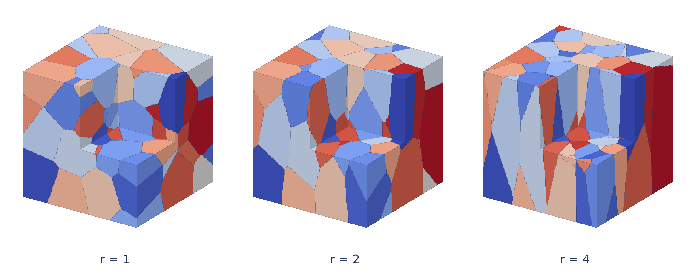
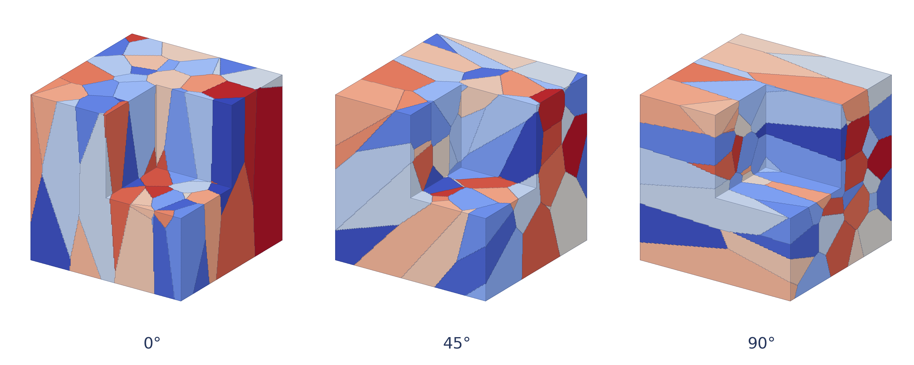

# Voxel polycrystal geometry

Generate a shared-node HEX8 mesh and zero-based grain IDs using NumPy/SciPy, then pass the mesh to JAX-FEM. This example models geometry only: it does not assign a constitutive law or run a mechanical solve.

The example keeps 64 seed coordinates fixed in a 0.3 mm cube. It compares the metric stretch `r = 1, 2, 4` along z, followed by directions tilted `0°, 45°, 90°` from z toward x at `r = 4`. The seed colors, camera, and displayed cutaway are identical across cases. The cutaway affects the rendering only; the output grid fills the cube.





Run from the repository root:

```bash
python -m applications.polycrystal.example
```

The default grid has **192³ = 7,077,888 elements**, with **1.5625 µm** edge length. It writes grain-label arrays and seed coordinates to compressed NPZ files, two PNG/PDF figures, and `validation.json` under `output/`. A quick preview uses `--divisions 48`. Mesh export is optional because explicit coordinates/connectivity are much larger than a label grid:

```bash
python -m applications.polycrystal.example --check-refinement
python -m applications.polycrystal.example --write-mesh
```

`--write-mesh` exports all five distinct cases as VTU files with a `grain_id` cell field. Constructing coordinates/connectivity for a 192³ grid requires about 381 MiB, before export/plotting overhead. NPZ output can also be converted directly to a JAX-FEM mesh:

```python
import jax
import numpy as np
from jax_fem.generate_mesh import Mesh
from applications.polycrystal.model import create_mesh

jax.config.update('jax_enable_x64', True)
data = np.load('applications/polycrystal/output/r4_theta45.npz')
points, cells = create_mesh(data['bounds'], data['divisions'])
mesh = Mesh(points, cells, ele_type='HEX8')
cell_grain_ids = data['grain_ids'].ravel()
```

For an existing volume mesh, `assign_grains(centers, seeds, stretch, direction)` assigns its element centers without changing its connectivity. Grain IDs always index the input seed array, including across different stretch/direction cases.

For unit direction **a**, the nearest seed minimizes `||T(x-s)||`, where `T = I + (1/r - 1) a aᵀ`. Both seed and query coordinates use this same metric. At `r = 1`, direction has no effect. The parameter `r` controls the distance metric; individual grain aspect ratios also depend on their neighbors and clipping by the domain. This is not a deformation/loading calculation. Periodic distances are used only for the minimum seed spacing; no periodic mesh or boundary conditions are imposed.

Grain interfaces follow element faces, so they are voxel approximations rather than a boundary-fitted tessellation. The render uses the actual labels without smoothing, and shows grain boundaries rather than individual element edges. It uses a blue/gray/red palette consistent with the existing crystal-plasticity example. Colors are categorical grain identifiers, not stress or crystal orientation.

Validation:

- `python -m pytest tests -q`: 10 tests and 10 subtests passed on CPU (JAX 0.6.2). New checks cover seed spacing and bounded rejection, direct anisotropic distances, isotropic/direction-sign/translation invariance, label/connectivity order, shared nodes, actual JAX-FEM integration weights, and a known planar interface.
- All five 192³ cases represent all 64 grains. Comparing grain volume fractions to 256³ grids gives a maximum total variation of `1.66e-4`, where total variation is half the sum of absolute fraction changes. The largest single-grain absolute fraction change is `7.60e-5` (0.00760 percentage points). This checks geometric volume resolution, not mechanical-response convergence.

For background on Voronoi polycrystal geometry and finite-element meshing, see R. Quey, P. R. Dawson and F. Barbe, “Large-scale 3D random polycrystals for the finite element method: Generation, meshing and remeshing,” *Computer Methods in Applied Mechanics and Engineering* 200 (2011), 1729–1745, [doi:10.1016/j.cma.2011.01.002](https://doi.org/10.1016/j.cma.2011.01.002). The lightweight voxel example here does not implement that paper's boundary-fitted meshing/remeshing algorithms.
