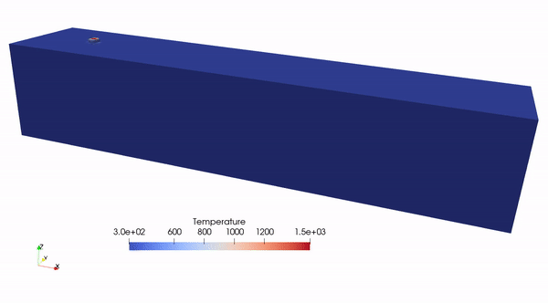

# Quiet-element thermal simulation for DED

## Overview

This example simulates transient heat transfer in a thin-wall direct energy
deposition (DED) process. The mesh contains the complete final geometry from
the beginning, while cells are activated progressively as the laser follows
the supplied toolpath. Inactive cells, faces, and nodes are kept *quiet* so
that they do not contribute to the finite-element equations before material
deposition.

| File | Purpose |
| --- | --- |
| `example.py` | Defines the thermal problem, updates the active topology, advances the toolpath, solves each time step, and writes VTU results. |
| `input/abaqus/thinwall.inp` | HEX8 mesh of the substrate and final thin wall, stored in millimetres. |
| `input/toolpath/thinwall_toolpath.crs` | Toolpath columns: time, laser position $(x,y,z)$ in millimetres, and laser switch (`0` or `1`). |
| `assets/ded.gif` | Example temperature evolution visualized in ParaView. |

## Thermal formulation

On the active domain $\Omega_a(t)$, the temperature satisfies

$$
\rho C_p \frac{\partial T}{\partial t}
= \nabla\cdot(k\nabla T).
$$

Backward Euler time integration gives the weak residual

$$
\int_{\Omega_a}
\rho C_p\frac{T^n-T^{n-1}}{\Delta t}v\,\mathrm{d}x
+\int_{\Omega_a}k\nabla T^n\cdot\nabla v\,\mathrm{d}x
-\int_{\Gamma_a}q_{\mathrm{in}}v\,\mathrm{d}s=0.
$$

The incoming surface flux is the sum of convection and, on the current top
surface while the laser is on, a Gaussian laser flux:

$$
q_{\mathrm{conv}}=h(T_0-T^{n-1}),
$$

$$
q_{\mathrm{laser}}
=\frac{2\eta P}{\pi r_b^2}
\exp\left[-\frac{2((x-x_l)^2+(y-y_l)^2)}{r_b^2}\right].
$$

The example uses SI units internally. The principal parameters are

| Parameter | Value |
| --- | ---: |
| Initial/ambient temperature $T_0$ | $300\ \mathrm{K}$ |
| Density $\rho$ | $8440\ \mathrm{kg/m^3}$ |
| Heat capacity $C_p$ | $500\ \mathrm{J/(kg\,K)}$ |
| Conductivity $k$ | $15\ \mathrm{W/(m\,K)}$ |
| Convection coefficient $h$ | $50\ \mathrm{W/(m^2\,K)}$ |
| Laser power $P$ | $500\ \mathrm{W}$ |
| Absorptivity $\eta$ | $0.4$ |
| Beam radius $r_b$ | $1\ \mathrm{mm}$ |

## How the quiet-element method is implemented

The complete final mesh is present throughout the simulation. The method does
not add or remove mesh entities; instead, Boolean tables decide which cells,
nodes, and faces participate at the current time step.

| Entity | How its state is determined | Treatment in the FE problem |
| --- | --- | --- |
| Cell | `active_cell_truth_tab[cell_id]` records whether material has been deposited in the cell. | Contributions from quiet cells are set to zero in both `get_tensor_map` and `get_mass_map`. |
| Node | A node is active if it belongs to at least one active cell. `quiet_point_inds_set` is the complement of this active-node set. | Quiet nodes are temporarily constrained to $T_0$, preventing zero rows and singular systems. |
| Face | `active_face_truth_tab[:, 0]` marks the current exterior of the active cells; column 1 marks exterior faces at the current laser height. | Convection acts on active exterior faces. Laser flux acts only on active top faces while the laser switch is on. |

### 1. Find active and quiet cells

Cells at or below the $20\ \mathrm{mm}$ substrate height are active initially.
During a laser-on step, the birth mask is evaluated from the cell centroids:

```python
below_laser = centroids[:, 2] < laser_center[2]
inside_beam = ((centroids[:, 0] - laser_center[0])**2
               + (centroids[:, 1] - laser_center[1])**2 <= rb**2)
active_cell_truth_tab |= below_laser & inside_beam
```

Activation is irreversible: once a cell becomes active, it remains active.
At quadrature points, the two volume maps use the cell marker as

```python
np.where(active_cell_marker, value, 0.)
```

so a quiet cell contributes neither conductivity nor heat capacity to the
assembled residual and tangent matrix.

### 2. Find quiet nodes

After cell activation, the nodes are classified from mesh connectivity:

```text
active nodes = nodes referenced by active cells
quiet nodes  = all mesh nodes - active nodes
```

`get_quiet_point_inds_set` performs this set difference. The resulting node
indices define a temporary Dirichlet condition $T=T_0$. A node shared by an
active and a quiet cell is active, because it is needed by the active cell.

### 3. Find active exterior and top faces

The code stores each face using its sorted node indices as a hash key. A face
seen once belongs to the current exterior; a face seen from two active cells
is internal. When cells are born, `update_hash_map` processes only those new
cells rather than rebuilding the active boundary from the complete mesh.

The exterior faces are then mapped into `active_face_truth_tab`:

```text
column 0: exterior face of the current active domain
column 1: exterior face whose vertices lie at the current laser height
```

This separates the two surface terms: convection uses column 0, while the
Gaussian laser flux uses column 1.

### 4. Update and solve

Each deposition step follows the same sequence. The topology-related work is
performed only when the active-cell set changes:

```text
evaluate the cell-birth mask
        ↓
if new cells were born:
    update exterior faces, quiet nodes, and face markers
else:
    reuse the current topology markers
        ↓
problem.set_params(...)
        ↓
solve the thermal system
```

Topology bookkeeping uses host NumPy arrays, while finite-element assembly
and solution remain in JAX. Cell birth replaces the quiet-node index arrays
between time steps, so the PETSc tangent cache refreshes its cached Dirichlet
rows when those arrays change and reuses them within the Newton solve.

## Time stepping

Toolpath coordinates are converted from millimetres to metres when they are
loaded. Laser-on segments are subdivided using a spatial resolution of
$0.125\ \mathrm{mm}$, so their time-step sizes follow the segment length and
duration. Each laser-off segment is divided into ten equal time steps.

## Running the example

Run from the repository root:

```bash
python -m applications.quiet_element.example
```

The supplied mesh contains 34,192 HEX8 cells and 40,444 temperature degrees
of freedom. The complete toolpath contains many small time steps, so the full
simulation can take substantially longer than the initial JIT compilation and
first solve.

## Output

At startup, the script clears `applications/quiet_element/output/vtk/` and
writes the imported mesh as `thinwall.vtu`. Temperature results are written as
`u_IIIII_JJJJJ.vtu`, where `I` is the toolpath index and `J` is the substep
index. Laser-on results are saved every ten substeps; laser-off results are
saved at every substep.

Each solution VTU contains

- nodal field `sol`: temperature;
- cell field `active`: `1` for active cells and `0` for quiet cells.

The results can be opened in ParaView and colored by `sol`; the `active` field
can be used to hide the undeployed part of the mesh.

<p align="center">
  
  <br />
  <em>Temperature evolution in the thin-wall DED simulation.</em>
</p>
