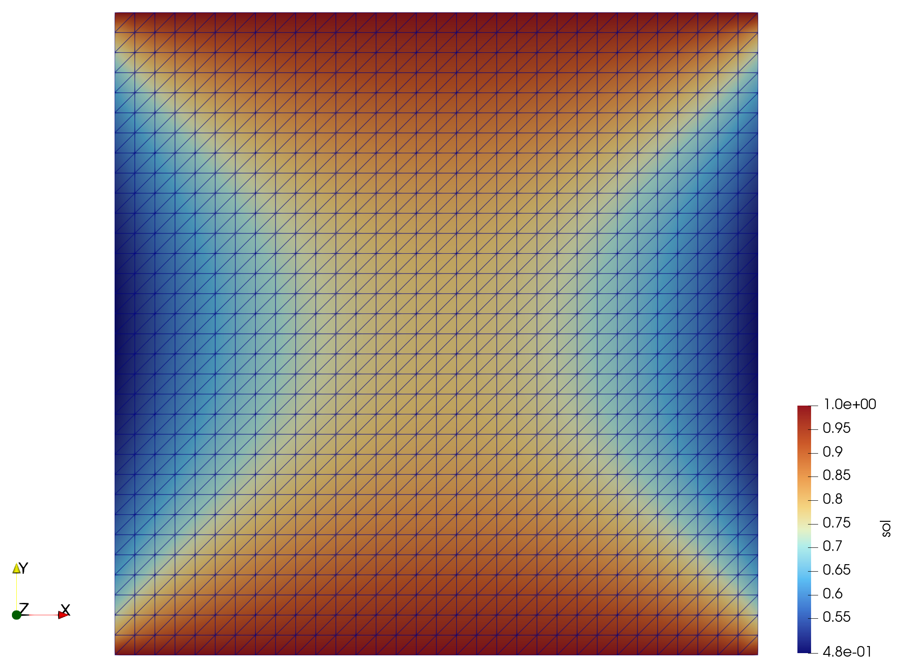

# Nonlinear Robin boundary conditions

## Overview

This example solves a scalar Poisson problem on the unit square with
Dirichlet conditions on the horizontal boundaries and nonlinear Robin
conditions on the vertical boundaries. It demonstrates how surface residuals
can be implemented in JAX-FEM with `get_universal_kernels_surface`.

| File | Purpose |
| --- | --- |
| `example.py` | Defines and solves the JAX-FEM problem and writes the solution to VTU. |
| `fenics.py` | Provides a legacy FEniCS reference solution and generates the NumPy mesh files used by JAX-FEM. |
| `input/numpy/` | Stores the points and triangular-cell connectivity for the unit-square mesh. |

## Formulation

Let $\Omega=(0,1)^2$, with the horizontal and vertical parts of its boundary
defined by

$$
\Gamma_D=\{y=0\}\cup\{y=1\},
\qquad
\Gamma_R=\{x=0\}\cup\{x=1\}.
$$

The strong form is

$$
\begin{aligned}
-\nabla^2 u &= f && \text{in } \Omega,\\
u &= 1 && \text{on } \Gamma_D,\\
\nabla u\cdot\boldsymbol{n}+5u^2 &= 0 && \text{on } \Gamma_R,
\end{aligned}
$$

where

$$
f(x,y)=x\sin(5\pi y)
+\exp\left(-\frac{(x-0.5)^2+(y-0.5)^2}{0.02}\right).
$$

The corresponding weak residual is

$$
R(u;v)
=\int_\Omega \nabla u\cdot\nabla v\,\mathrm{d}x
-\int_\Omega fv\,\mathrm{d}x
+\int_{\Gamma_R}5u^2v\,\mathrm{d}s
=0
$$

for every test function $v$ that vanishes on $\Gamma_D$.

## Implementation

`Poisson.get_universal_kernel` assembles the two volume terms. The boundary
function list `location_fns = [left, right]` selects the two parts of
$\Gamma_R$, and `get_universal_kernels_surface` returns one surface kernel for
each of them. Within a surface kernel, $u$ is interpolated at the face
quadrature points and the contribution $5u^2v$ is assembled into the element
residual. JAX automatic differentiation supplies the consistent tangent of
this nonlinear boundary term to the Newton solver.

The same boundary contribution can also be expressed with the shorter
`get_surface_maps` interface shown in the commented section of `example.py`.
The universal surface kernel is used here to expose the lower-level assembly
operations.

The mesh contains 2,048 linear triangular elements and 1,089 nodes. A
quadrature order of two is selected to match the FEniCS reference calculation.

## Execution

Run the JAX-FEM example from the `jax-fem/` directory:

```bash
python -m applications.robin_bc.example
```

The solution is written to

```text
applications/robin_bc/output/vtk/u_jax-fem.vtu
```

The optional reference calculation requires legacy FEniCS (`dolfin`):

```bash
python -m applications.robin_bc.fenics
```

In addition to writing `u_fenics.pvd`, this script regenerates the point and
cell arrays under `input/numpy/`.

## Expected results

With the supplied mesh, the JAX-FEM nonlinear solve converges in five Newton
iterations. The nodal solution has

$$
\min u \approx 0.4760543,
\qquad
\max u = 1.
$$

The maximum is attained on the prescribed top and bottom boundaries, while
the nonlinear Robin condition lowers the solution near the left and right
boundaries.

<p align="center">
  
  <br />
  <em>JAX-FEM solution on the triangular unit-square mesh.</em>
</p>
