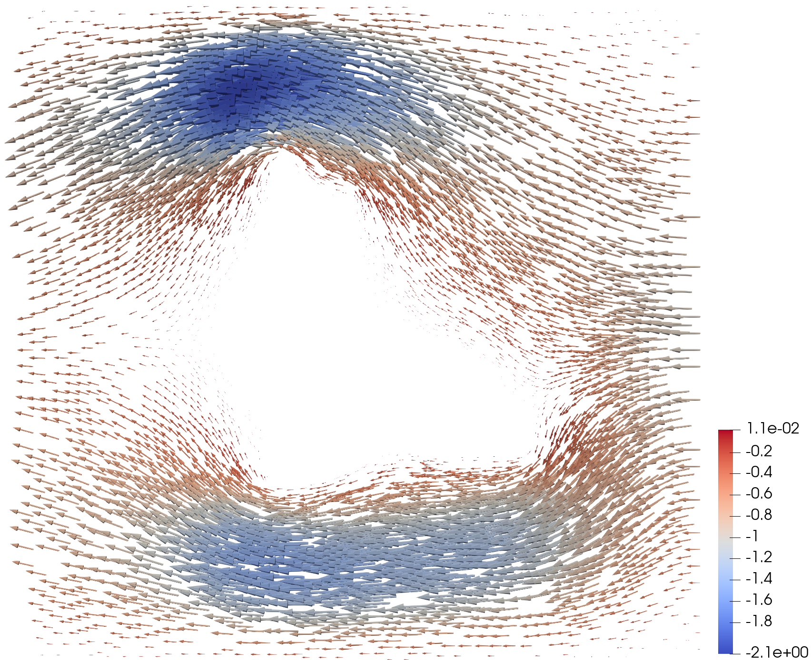
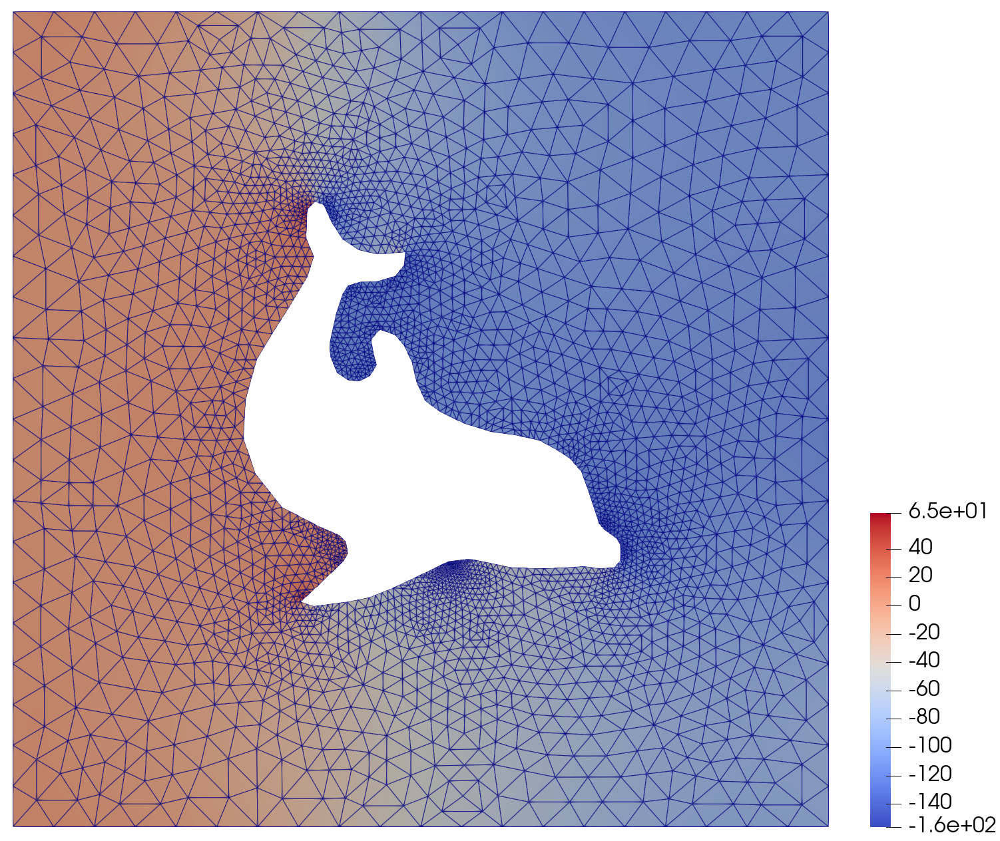

# Mixed finite element problems: Stokes flow

This directory is a tutorial on coupled finite element variables in JAX-FEM.
The first point to make is that `example_1var.py` and `example_2vars.py` solve
**exactly the same three-dimensional elasticity problem**. After concatenating
the two fields returned by `example_2vars.py`,

$$
\boldsymbol{u}_h^{\mathrm{1var}}
=\operatorname{concat}\!\left(u_h^{(1)},\boldsymbol{u}_h^{(2)}\right)
=\boldsymbol{u}_h^{\mathrm{2vars}},
\qquad
\left\|\boldsymbol{u}_h^{\mathrm{1var}}
-\boldsymbol{u}_h^{\mathrm{2vars}}\right\|_\infty
\approx 6.9\times10^{-18}.
$$

For an ordinary vector-valued problem, the one-variable pattern is usually
the natural choice. `example_2vars.py` is an intentionally artificial teaching
example: it splits $[u_x,u_y,u_z]$ into $[u_x]$ and $[u_y,u_z]$ solely to make
JAX-FEM's multi-variable data flow visible before any new physics is added.

In general, a coupled JAX-FEM problem collects several fields and their
residuals in the same order,

$$
\mathcal{U}_h=\left(u_h^{(1)},\ldots,u_h^{(N_f)}\right),
\qquad
\mathcal{R}(\mathcal{U}_h)
=\left(R_1,\ldots,R_{N_f}\right)=\boldsymbol{0}.
$$

Each field may have its own vector dimension, interpolation space, mesh
connectivity, and boundary conditions. `example.py` then moves from the
artificial split to a genuine mixed problem: velocity and pressure interact
through one Stokes residual.

## The learning path

| File | Variables | Role |
| --- | --- | --- |
| `example_1var.py` | One field with `vec=3` | Establishes a three-component linear-elasticity reference solution. |
| `example_2vars.py` | Two fields with `vec=[1, 2]` | Splits the same displacement into two variables and verifies that multi-variable bookkeeping reproduces the one-field solution. |
| `example.py` | Velocity and pressure with `vec=[2, 1]` | Solves the actual mixed Stokes problem with different interpolation orders for the two fields. |
| `fenics.py` | A mixed FEniCS function | Supplies the reference implementation and generates the NumPy meshes used by `example.py`. |

The progression separates two possible sources of difficulty. First,
`example_1var.py` and `example_2vars.py` test only how JAX-FEM packs fields,
assembles their residuals, and applies field-specific boundary conditions.
Once that equivalence is established, `example.py` introduces the genuinely
mixed ingredients: different finite element spaces and off-diagonal
velocity-pressure coupling.

## From one field to multiple fields

### One vector-valued variable

`example_1var.py` solves a small three-dimensional elasticity problem with a
single finite element variable:

```python
problem = LinearElasticity(
    mesh,
    vec=3,
    dim=3,
    ele_type="HEX8",
    dirichlet_bc_info=dirichlet_bc_info,
)
```

At each node, the three displacement components are stored together. The
element kernel therefore receives one array with shape `(num_nodes, 3)` and
returns one residual array of the same shape.

### The same physics split into two variables

`example_2vars.py` deliberately solves the identical elasticity problem after
splitting the displacement components into two fields:

```python
problem = LinearElasticity(
    [mesh, mesh],
    vec=[1, 2],
    dim=3,
    ele_type=["HEX8", "HEX8"],
    quadrature_order=[None, None],
    dirichlet_bc_info=[dirichlet_bc_info1, dirichlet_bc_info2],
)
```

The first field stores the first displacement component and the second stores
the remaining two. Inside `get_universal_kernel`, the field-local arrays are
recovered and concatenated before evaluating the original constitutive law:

```python
cell_sol_list = self.unflatten_fn_dof(cell_sol_flat)
cell_sol = np.concatenate(cell_sol_list, axis=1)
```

After the three-component elastic residual has been assembled, it is split
back into the same structure as the unknowns:

```python
val = [val[:, :1], val[:, 1:]]
return jax.flatten_util.ravel_pytree(val)[0]
```

This "unpack, evaluate the coupled physics, repack" pattern is the central
idea behind a multi-variable JAX-FEM kernel. On the supplied mesh, the
one-field solution has shape `(12, 3)` and the split solution has shapes
`(12, 1)` and `(12, 2)`. Their equality, stated at the beginning, confirms that
the artificial split changes only data organization—not the finite element
problem or its solution.

Both variables in `example_2vars.py` use the same `HEX8` mesh and basis, so
their shape functions and gradients are identical; the kernel can reuse the
first field's geometric slice for all three reconstructed components. That
shortcut is intentionally removed in the Stokes example, where velocity and
pressure live in different spaces.

## Stokes formulation

The main example considers steady, incompressible Stokes flow with unit
viscosity and zero body force in the unit square containing a dolphin-shaped
obstacle. In the sign convention used by the accompanying FEniCS example,
the two field residuals are

$$
\begin{aligned}
R_u(\boldsymbol{u},p;\boldsymbol{v})
&=\int_\Omega \nabla\boldsymbol{u}:\nabla\boldsymbol{v}\,\mathrm{d}x
+\int_\Omega p\,\nabla\cdot\boldsymbol{v}\,\mathrm{d}x=0,\\
R_p(\boldsymbol{u};q)
&=\int_\Omega q\,\nabla\cdot\boldsymbol{u}\,\mathrm{d}x=0.
\end{aligned}
$$

Here $\boldsymbol{v}$ and $q$ are the velocity and pressure test functions.
$R_u$ is the momentum residual, while $R_p$ enforces incompressibility.

The boundary conditions are:

- right boundary: prescribed inflow
  $\boldsymbol{u}=(-\sin(\pi y),0)$;
- top, bottom, and dolphin boundaries: no slip,
  $\boldsymbol{u}=\boldsymbol{0}$;
- left boundary: prescribed outlet pressure $p=0$.

The left-edge pressure condition also fixes the otherwise undetermined
pressure level. Velocity on that outlet uses the natural condition arising
from the weak form.

## Taylor-Hood spaces are truly different fields

Velocity uses quadratic `TRI6` elements and pressure uses linear `TRI3`
elements. This is the classical Taylor-Hood $P_2/P_1$ pair:

$$
\boldsymbol{u}_h\in [P_2]^2,
\qquad
p_h\in P_1.
$$

The two meshes describe the same 5,400 physical triangles but have different
nodal sets:

| Field | Element | Nodes | Components | Degrees of freedom |
| --- | --- | ---: | ---: | ---: |
| Velocity $\boldsymbol{u}$ | `TRI6` | 11,136 | 2 | 22,272 |
| Pressure $p$ | `TRI3` | 2,868 | 1 | 2,868 |
| **Coupled system** | — | — | — | **25,140** |

The corresponding JAX-FEM construction passes one mesh, vector size, element
type, quadrature setting, and boundary-condition description per variable:

```python
problem = StokesFlow(
    [mesh_u, mesh_p],
    vec=[2, 1],
    dim=2,
    ele_type=["TRI6", "TRI3"],
    quadrature_order=[2, 2],
    dirichlet_bc_info=[dirichlet_bc_info1, dirichlet_bc_info2],
)
```

JAX-FEM creates `problem.fes[0]` for velocity and `problem.fes[1]` for
pressure. The global unknown is flattened for the solver, but the returned
solution preserves the field structure:

```python
sol_list = solver(problem, solver_options=...)
u, p = sol_list
```

The meshes in this list must be cell-aligned rather than unrelated: cell $i$
must describe the same physical region in every field, and the fields must use
compatible quadrature points. Here, the `TRI6` and `TRI3` arrays have the same
5,400 cells in the same order; only their local and global node sets differ.

## Anatomy of the coupled element kernel

Convenience interfaces such as `get_tensor_map` are well suited to a
single-field constitutive law. A mixed formulation needs simultaneous access
to all trial and test fields, so `StokesFlow` implements
`get_universal_kernel` instead.

For one element, `self.unflatten_fn_dof(cell_sol_flat)` reconstructs

```text
cell_sol_u: (6, 2)   # six quadratic velocity nodes, two components
cell_sol_p: (3, 1)   # three linear pressure nodes, one component
```

Geometric arrays for all variables arrive concatenated along their node axis.
`self.num_nodes_cumsum` supplies the field boundaries needed to split
`cell_shape_grads` and `cell_v_grads_JxW` back into velocity and pressure
parts. The kernel then assembles three contributions:

| Code | Weak-form term | Residual shape |
| --- | --- | --- |
| `val1` | $\int_\Omega \nabla\boldsymbol{u}:\nabla\boldsymbol{v}\,\mathrm{d}x$ | `(6, 2)` |
| `val2` | $\int_\Omega p\,\nabla\cdot\boldsymbol{v}\,\mathrm{d}x$ | `(6, 2)` |
| `val3` | $\int_\Omega q\,\nabla\cdot\boldsymbol{u}\,\mathrm{d}x$ | `(3, 1)` |

The field residuals are returned in the same order as the fields:

```python
weak_form = [val1 + val2, val3]
return jax.flatten_util.ravel_pytree(weak_form)[0]
```

Automatic differentiation of this one element residual generates every block
of the coupled tangent matrix, including the velocity-pressure and
pressure-velocity blocks:

$$
J=
\begin{bmatrix}
\partial R_u/\partial \boldsymbol{u} & \partial R_u/\partial p\\
\partial R_p/\partial \boldsymbol{u} & \partial R_p/\partial p
\end{bmatrix}.
$$

This is why the example generalizes beyond fluid flow: the same mechanism can
represent any set of interacting finite element fields, provided the kernel
returns one residual array per field.

For a new coupled problem, the reusable recipe is therefore:

1. Create one aligned `Mesh` and finite element description per field.
2. Pass lists for `mesh`, `vec`, `ele_type`, and `dirichlet_bc_info`.
3. Unpack `cell_sol_flat` and split concatenated geometric arrays by field.
4. Assemble every field residual, including cross-field terms.
5. Return the residual list in exactly the same order and structure as the
   unknown fields.

## Mesh and obstacle boundary

The supplied arrays under `input/numpy/` are sufficient to run JAX-FEM; it is
not necessary to run FEniCS first. `fenics.py` is an optional legacy DOLFIN
reference that reads the marked XML mesh, solves the mixed problem, and
exports the `TRI6` velocity and `TRI3` pressure connectivity as NumPy arrays.

The NumPy connectivity does not retain the FEniCS boundary markers around the
interior obstacle. `configure_Dirichlet_BC_for_dolphin` reconstructs those
boundaries from the quadratic mesh: a midside node belonging to only one cell
identifies a boundary edge. After excluding the left and right edges, the
method applies no-slip values to the top, bottom, and dolphin boundaries.
`transform_cells` additionally ensures that imported triangles use the
counter-clockwise orientation expected by JAX-FEM.

## Running the examples

Run all commands from the `jax-fem/` directory. For the intended learning
sequence, start with the two equivalent elasticity representations:

```bash
python -m applications.stokes.example_1var
python -m applications.stokes.example_2vars
```

These examples generate a two-element `HEX8` mesh with Gmsh. Then run the
mixed Taylor-Hood problem:

```bash
python -m applications.stokes.example
```

The configured PETSc solve uses `tfqmr` with an LU preconditioner and selects
MUMPS as the factorization backend. Check that the PETSc installation includes
MUMPS with

```bash
python -c "from petsc4py import PETSc; print(PETSc.Sys.hasExternalPackage('mumps'))"
```

If this prints `False`, PETSc was built without MUMPS. Use a PETSc build that
includes MUMPS, or switch to the adjacent `spsolve_solver` alternative already
shown in `example.py`.

The JAX-FEM solution is written to

```text
applications/stokes/output/vtk/jax-fem_velocity.vtu
applications/stokes/output/vtk/jax-fem_pressure.vtu
```

The optional legacy FEniCS reference can be run in an environment containing
`dolfin`:

```bash
python -m applications.stokes.fenics
```

Be aware that it also regenerates the four arrays under `input/numpy/`.

## Expected result

With the supplied mesh, the mixed system converges in one Newton step (the
problem is linear). A PETSc/MUMPS run gives a linear residual around
$2.4\times10^{-13}$ and the following nodal extrema:

| Field | Minimum | Maximum |
| --- | ---: | ---: |
| Velocity components | $-2.0991937$ | $0.7161870$ |
| Pressure | $-156.6099544$ | $65.0685686$ |

<p align="middle">
  
  
</p>
<p align="middle">
  <em>Stokes flow: velocity (left) and pressure (right).</em>
</p>
