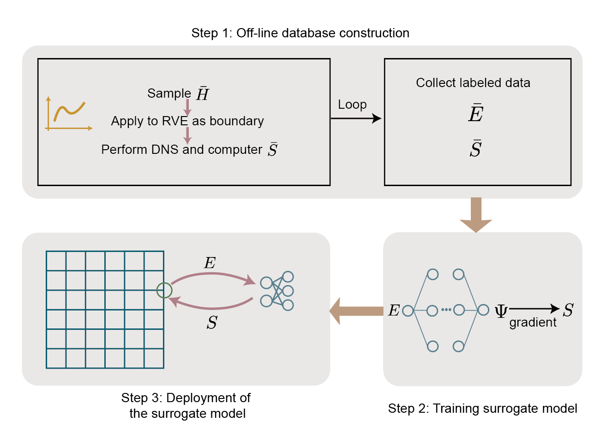
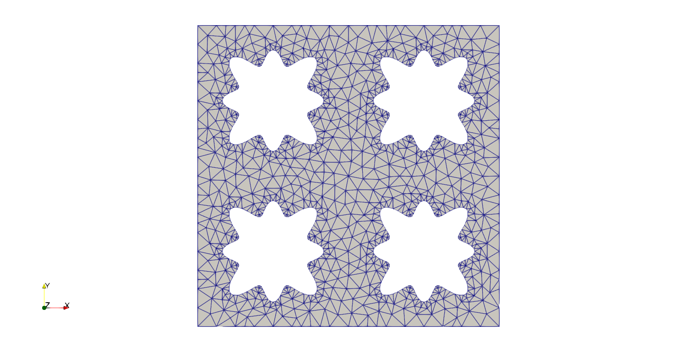
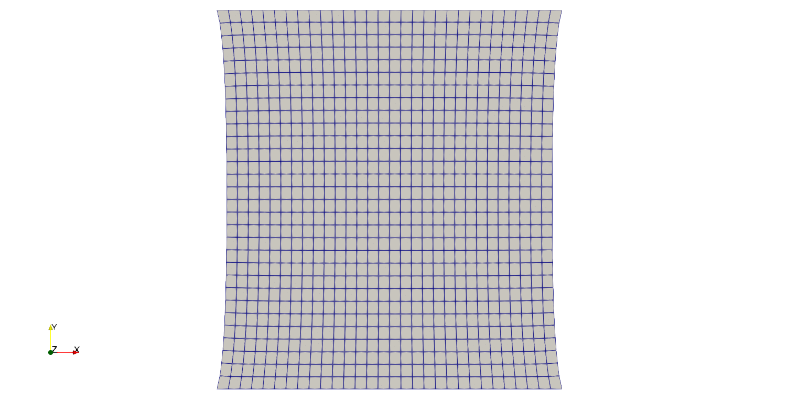
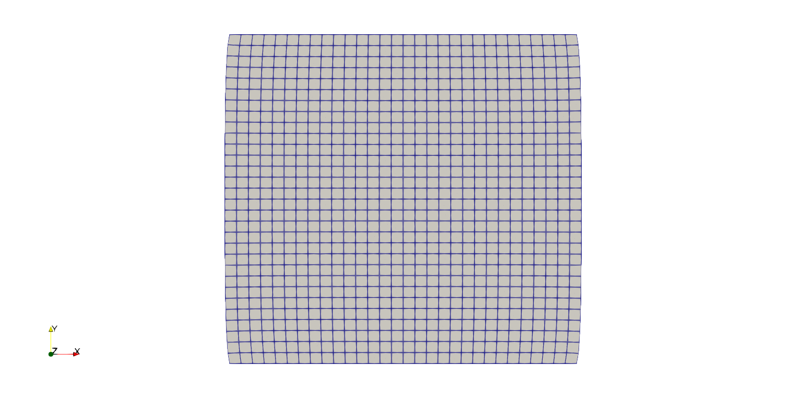

# Neural Network Surrogate Model

## Work flow

  

The neutral network surrogate model computational homogenization procedure steps. 

(1) Build the offline training database by performing RVE calculations at the cellular level, with the data including average Euler-Lagrange strain ($\bar E$) and the average second Piola-Kirchhoff stress ($\bar S$). (We used FEniCS for the data generation because JAX-FEM does not support periodic boundary conditions yet.)

(2) Train a neural network to develop a surrogate model for the effective strain energy density ($\Psi$), where the gradient with respect to the input yields $\bar S$. (We also uploaded a model file, so you may train the network yourself or simply use the model file provided.)

(3) Deploy the surrogate model for macroscopic problems.

## RVE

  

Geometry for RVE

FEM calculation on the RVE under macroscopic deformations $\bar F$ by prescribing the following periodic boundary conditions:

$$
\begin{align} 
\boldsymbol{u}(\boldsymbol{X})=(\overline{\boldsymbol{F}}-\boldsymbol{I}) \cdot \boldsymbol{X}+\boldsymbol{u}^\star(\boldsymbol{X})=\overline{\boldsymbol{H}} \cdot \boldsymbol{X}+\boldsymbol{u}^\star(\boldsymbol{X})
\end{align}
$$

See [1] for more details.

## Execution

Run

`python -m applications.surrogate_model.example`

## Results

Visualized with ParaView:

   
  

    <em >Deformation under 20% stretch (left) and 5% compression (right)</em>

## Author

This example was constributed by Min Shen from Prof. Sheng Mao's research group at Peking University.

## Reference

[1] Xue, Tianju, Alex Beatson, Maurizio Chiaramonte, Geoffrey Roeder, Jordan T. Ash, Yigit Menguc, Sigrid Adriaenssens, Ryan P. Adams, and Sheng Mao. "A data-driven computational scheme for the nonlinear mechanical properties of cellular mechanical metamaterials under large deformation." Soft matter 16, no. 32 (2020): 7524-7534.

