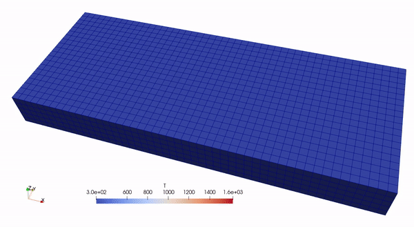
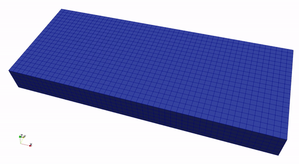

# Thermal-mechanical Coupling

## Formulation

### Governing Equations

We solve a time-dependent problem that involves one-way coupling (temperature field $T$ affects displacement field $\boldsymbol{u}$). The scenario considered here is a Laser Powder Bed Fusion (LPBF) process. We ignore the powder geometry and only consider a box domain $\Omega=[0, L_x]\times[0,L_y]\times[0,L_z]$ for this problem. The governing PDE of heat equation states that

$$
\begin{align*}
\rho C_p \frac{\partial T}{\partial t} &= \nabla \cdot (k \nabla T) &   &\textrm{in}  \nobreakspace \nobreakspace \Omega \times(0, t_f],  \\
T  &= T_0 &  &\textrm{at} \nobreakspace \nobreakspace t=0, \\
T&=T_D & &\textrm{on} \nobreakspace \nobreakspace \Gamma_{D} \times (0,t_f], \\
k\nabla T \cdot \boldsymbol{n} &= q &&  \textrm{on} \nobreakspace \nobreakspace \Gamma_N \times (0,t_f],
\end{align*}
$$

where $\rho$ is material density, $C_p$ is heat capacity, $k$ is thermal conductivity and $q$ is heat flux. The governing PDE of momentum balance states that

$$
\begin{align*}
    -\nabla \cdot \boldsymbol{\sigma} &= \boldsymbol{0} && \textrm{in}  \nobreakspace \nobreakspace \Omega \times(0, t_f], \nonumber \\
    \boldsymbol{u} &= \boldsymbol{u}_D    && \textrm{on} \nobreakspace \nobreakspace \Gamma_D\times(0, t_f],   \\
    \boldsymbol{\sigma} \cdot \boldsymbol{n} &= \boldsymbol{0}   && \textrm{on} \nobreakspace \nobreakspace \Gamma_N\times(0, t_f].
\end{align*}
$$

### Discretization in Time

Let us first discretize in time and obtain the governing equation at time step $n$ for the temperature field:

$$
\begin{align*}
\rho C_p \frac{T^n - T^{n-1}}{\Delta t} &= \nabla \cdot k \nabla T^n &   &\textrm{in}  \nobreakspace \nobreakspace \Omega,  \\
T^n &= T_{\textrm{ambient}} && \textrm{on} \nobreakspace \nobreakspace \Gamma_{\textrm{bottom}}, \\
k\nabla T^n \cdot \boldsymbol{n} &= q_{\textrm{rad}} + q_{\textrm{conv}} && \textrm{on} \nobreakspace \nobreakspace \Gamma_{\textrm{walls}}, \\
k\nabla T^n \cdot \boldsymbol{n} &= q_{\textrm{laser}} + q_{\textrm{rad}} + q_{\textrm{conv}} && \textrm{on} \nobreakspace \nobreakspace \Gamma_{\textrm{top}}, \\
\end{align*}
$$

where $T^n$ is the unknown variable field to be solved, $T^{n-1}$ is known from previous time step. We have imposed Dirichlet boundary condition on the bottom side $\Gamma_{\textrm{bottom}}$ with $T_{\textrm{ambient}}$ being the ambient temperature. On the four side walls $\Gamma_{\textrm{walls}}$,  convective and radiative heat loss  ($q_{\textrm{rad}}$ and $q_{\textrm{conv}}$) are considered. While on the top side $\Gamma_{\textrm{top}}$, laser heat flux $q_{\textrm{laser}}$ should be added. These heat flux terms are defined as the following:


$$
\begin{align*}
q_{\textrm{rad}} &= \sigma \epsilon ( T_{\textrm{ambient}}^4 - (T^{n-1})^4), \\
q_{\textrm{conv}} &= h(T_{\textrm{ambient}} - T^{n-1}), \\
q_{\textrm{laser}} &= \frac{2\eta P}{\pi r_b^2} \textrm{exp}\Big( \frac{-2 \big( (x-x_l)^2 + (y-y_l)^2 \big)}{r_b^2} \Big),
\end{align*}
$$

where $\sigma$ is Stefan-Boltzmann constant, $\epsilon$ is emissivity of the material, $h$ is convection heat-transfer coefficient, $P$ is laser power, $\eta$ is absorption coefficient, $r_b$ is laser beam radius and $(x_l, y_l)$ is laser position. Note that $T^{n-1}$ is used in $q_{\textrm{rad}}$ and $q_{\textrm{conv}}$ so that this recovers Neumann boundary conditions. If we use $T^n$, we will get Robin boundary conditions that require different treatment, which is possible in _JAX-FEM_ but not used in this particular tutorial.

Next, we consider solving $\boldsymbol{u}^n$ with a perfect J2-plasticity model also considering thermal strain. We assume that the total strain $\boldsymbol{\varepsilon}^{n-1}$ and stress $\boldsymbol{\sigma}^{n-1}$ from the previous loading step are known and the temperature solution at current step $T^n$ is also known. The problem states that find the displacement field $\boldsymbol{u}^n$ at the current loading step such that

$$
\begin{align*} 
    -\nabla \cdot \big(\boldsymbol{\sigma}^n (\nabla \boldsymbol{u}^n, \boldsymbol{\varepsilon}^{n-1}, \boldsymbol{\sigma}^{n-1}, \Delta T^n) \big) = \boldsymbol{0} & \quad \textrm{in}  \nobreakspace \nobreakspace \Omega, \nonumber \\
    \boldsymbol{u}^n = \boldsymbol{u}_D &  \quad\textrm{on} \nobreakspace \nobreakspace \Gamma_D,  \nonumber \\
    \boldsymbol{\sigma}^n \cdot \boldsymbol{n} = \boldsymbol{0}  & \quad \textrm{on} \nobreakspace \nobreakspace \Gamma_N.
\end{align*}
$$

The stress $\boldsymbol{\sigma}^n$ is defined through the following relationships:

```math
\begin{align*} 
    \boldsymbol{\sigma}_\textrm{trial} &= \boldsymbol{\sigma}^{n-1} + \Delta \boldsymbol{\sigma}, \nonumber\\
    \Delta \boldsymbol{\sigma} &= \lambda \nobreakspace \textrm{tr}(\Delta \boldsymbol{\varepsilon}) \boldsymbol{I} + 2\mu \nobreakspace \Delta \boldsymbol{\varepsilon}, \nonumber \\
    \Delta \boldsymbol{\varepsilon} &= \boldsymbol{\varepsilon}^n  - \boldsymbol{\varepsilon}^{n-1} -  \boldsymbol{\varepsilon}_{\textrm{th}} = \frac{1}{2}\left[\nabla\boldsymbol{u}^n + (\nabla\boldsymbol{u}^n)^{\top}\right] - \boldsymbol{\varepsilon}^{n-1} - \boldsymbol{\varepsilon}_{\textrm{th}}, \nonumber\\
    \boldsymbol{\varepsilon}_{\textrm{th}}  &= \alpha_V \Delta T^n \boldsymbol{I} = \alpha_V (T^n - T^{n-1}) \boldsymbol{I},\\
    \boldsymbol{s} &= \boldsymbol{\sigma}_\textrm{trial} - \frac{1}{3}\textrm{tr}(\boldsymbol{\sigma}_\textrm{trial})\boldsymbol{I},\nonumber\\
    s &= \sqrt{\frac{3}{2}\boldsymbol{s}:\boldsymbol{s}}, \nonumber\\
    f_{\textrm{yield}} &= s - \sigma_{\textrm{yield}}, \nonumber\\
    \boldsymbol{\sigma}^n &= \boldsymbol{\sigma}_\textrm{trial} -  \frac{\boldsymbol{s}}{s} \langle f_{\textrm{yield}} \rangle_{+}, \nonumber
\end{align*}
```

where $`\boldsymbol{\varepsilon}_{\textrm{th}}`$ is the thermal strain, and the other parameters are explained in our [plasticity example](https://github.com/tianjuxue/jax-am/tree/main/demos/fem/plasticity). Note that we define material phase to be either in POWDER, LIQUID or SOLID state. A material point is initially in POWDER state, and transforms into LIQUID state if the temperature goes beyond the melting point, and transforms from LIQUID to SOLID state if the temperature drops below the melting point thereafter. The Young's modulus $E$  is set to be a normal value for the SOLID state, while 1% of that for the LIQUID and POWDER state. The thermal expansion coefficient $\alpha_V$ is set to be a normal value for the SOLID state, while 0 for the LIQUID and POWDER state. 


### Weak Form

The weak form for $T^n$ is the following:

$$
\begin{align*}
\int_{\Omega}  \rho C_p \frac{T^n - T^{n-1}}{\Delta t} \delta T \nobreakspace \nobreakspace \textrm{d}x + \int_{\Omega} k \nabla T^n : \nabla \delta T \nobreakspace \nobreakspace \textrm{d}x = \int_{\Gamma_{\textrm{walls}}} (q_{\textrm{rad}} + q_{\textrm{conv}} )\nobreakspace \delta T \nobreakspace \nobreakspace \textrm{d}s   + \int_{\Gamma_{\textrm{top}}} (q_{\textrm{laser}} + q_{\textrm{rad}} + q_{\textrm{conv}} )\nobreakspace \delta T \nobreakspace \nobreakspace \textrm{d}s.
\end{align*}
$$

The weak form for $\boldsymbol{u}^n$ is the following: 

$$
\begin{align*}
\int_{\Omega}  \boldsymbol{\sigma}^n : \nabla \delta \boldsymbol{u} \nobreakspace \nobreakspace \textrm{d}x = 0.
\end{align*}
$$

For each time step, we first solve for $T^n$ and then solve for $\boldsymbol{u}^n$ that depends on $T^n$, hence forming the one-way coupling mechanism. Finally, a good reference on this subject is this paper [1] from Northwestern AMPL, where a Direct Energy Deposition (DED) process is considered.

## Implementation

Import some useful modules
```python
import jax
import jax.numpy as np
import os
import glob

from jax_am.fem.generate_mesh import box_mesh, Mesh, get_meshio_cell_type
from jax_am.fem.solver import solver
from jax_am.fem.core import FEM
from jax_am.fem.utils import save_sol
```

If you have multiple GPUs, set the one to use. 
```python
os.environ["CUDA_VISIBLE_DEVICES"] = "2"
```

Define some useful directory paths
```python
crt_file_path = os.path.dirname(__file__)
data_dir = os.path.join(crt_file_path, 'data')
vtk_dir = os.path.join(data_dir, 'vtk')
```


Define the thermal problem. The function `get_tensor_map` is responsible for the term $\int_{\Omega} k \nabla T^n : \nabla \delta T \nobreakspace \nobreakspace \textrm{d}x$. The function `get_mass_map` is responsible for the term $\int_{\Omega}  \rho C_p \frac{T^n - T^{n-1}}{\Delta t} \delta T \nobreakspace \nobreakspace \textrm{d}x$. The function `set_params` makes sure that the Neumann boundary conditions use the most updated $T^{n-1}$ and laser information, i.e., positional information like `laser_center`  $(x_l, y_l)$ and `switch` controlling ON/OFF of the laser. 

```python
class Thermal(FEM):
    """We solve the following equation (weak form of FEM):
    (rho*Cp/dt*(T_crt-T_old), Q) * dx + (k*T_crt_grad, Q_grad) * dx - (heat_flux, Q) * ds = 0
    where T_crt is the trial function, and Q is the test function.
    """
    def get_tensor_map(self):
        """Override base class method.
        """
        def fn(u_grad):
            return k*u_grad
        return fn
 
    def get_mass_map(self):
        """Override base class method.
        """
        def T_map(T, T_old):

            return rho*Cp*(T - T_old)/dt
        return T_map

    def set_params(self, params):
        """Override base class method.
        Note that 'neumann' and 'mass' are reserved keywords.
        """
        sol_T_old, laser_center, switch = params
        self.internal_vars['neumann'] = [[self.convert_neumann_from_dof(sol_T_old, 0)], 
                                         [self.convert_neumann_from_dof(sol_T_old, 1)]]
        self.internal_vars['mass'] = [self.convert_from_dof_to_quad(sol_T_old)]
        self.neumann_value_fns[0] = get_thermal_neumann_top(laser_center, switch)
```

Define the mechanics problem. Generally, *JAX-FEM* handles $\int_{\Omega}`\boldsymbol{f}(\nabla \boldsymbol{u}, \boldsymbol{\alpha}_1,\boldsymbol{\alpha}_2,...,\boldsymbol{\alpha}_N): \nabla \delta \boldsymbol{u}` \nobreakspace \nobreakspace \textrm{d}x$ in the weak form. Here, we have $`\boldsymbol{f}(\nabla \boldsymbol{u}, \boldsymbol{\alpha}_1,\boldsymbol{\alpha}_2,...,\boldsymbol{\alpha}_N)=\boldsymbol{\sigma}^n (\nabla \boldsymbol{u}^n, \boldsymbol{\varepsilon}^{n-1}, \boldsymbol{\sigma}^{n-1}, \Delta T^n, \zeta^n)`$ with $\zeta^n$ being the phase state variable. This is reflected by the function `stress_return_map`.
```python
class Plasticity(FEM):
    """We solve the following equation (weak form of FEM):
    (sigma(u_grad), v_grad) * dx = 0
    where u is the trial function, and v is the test function.
    """
    def custom_init(self):
        """Initializing total strain, stress, temperature increment, and material phase.
        Note that 'laplace' is a reserved keywork that speficically refers to the internal variables.
        """
        sigmas_old = np.zeros((len(self.cells), self.num_quads, self.vec, self.dim))
        epsilons_old = np.zeros_like(sigmas_old)
        dT = np.zeros((len(self.cells), self.num_quads, 1))
        phase = np.ones_like(dT, dtype=np.int32)*POWDER
        self.internal_vars['laplace'] = [sigmas_old, epsilons_old, dT, phase]
    
    def get_tensor_map(self):
        """Override base class method.
        """
        _, stress_return_map, _ = self.get_maps()
        return stress_return_map

    def get_maps(self):
        def safe_sqrt(x):  
            safe_x = np.where(x > 0., np.sqrt(x), 0.)
            return safe_x

        def safe_divide(x, y):
            return np.where(y == 0., 0., x/y)

        def strain(u_grad):
            epsilon = 0.5*(u_grad + u_grad.T)
            return epsilon

        def stress(epsilon, E):
            nu = 0.3
            mu = E/(2.*(1. + nu))
            lmbda = E*nu/((1+nu)*(1-2*nu))
            sigma = lmbda*np.trace(epsilon)*np.eye(self.dim) + 2*mu*epsilon
            return sigma

        def stress_return_maps(u_grad, sigma_old, epsilon_old, dT, phase):
            E0 = 70.e9
            sig0 = 250.e6 
            alpha_V0 = 1e-5
            alpha_V = np.where(phase == SOLID, alpha_V0, 0.)
            E = np.where(phase == SOLID, E0, 1e-2*E0)
            epsilon_inc_T = alpha_V*dT*np.eye(self.dim)
            epsilon_crt = strain(u_grad)
            epsilon_inc = epsilon_crt - epsilon_old
            sigma_trial = stress(epsilon_inc - epsilon_inc_T, E) + sigma_old
            s_dev = sigma_trial - 1./self.dim*np.trace(sigma_trial)*np.eye(self.dim)
            s_norm = safe_sqrt(3./2.*np.sum(s_dev*s_dev))
            f_yield = s_norm - sig0
            f_yield_plus = np.where(f_yield > 0., f_yield, 0.)
            sigma = sigma_trial - safe_divide(f_yield_plus*s_dev, s_norm)
            return sigma, (f_yield_plus, sigma[0, 0])

        stress_return_map = lambda *args: stress_return_maps(*args)[0]
        yield_val_fn = lambda *args: stress_return_maps(*args)[1]

        return strain, stress_return_map, yield_val_fn

    def vmap_stress_strain_fns(self):
        strain, stress_return_map, yield_val_fn = self.get_maps()
        vmap_strain = jax.vmap(jax.vmap(strain))
        vmap_stress_return_map = jax.vmap(jax.vmap(stress_return_map))
        vmap_yield_val_fn = jax.vmap(jax.vmap(yield_val_fn))
        return vmap_strain, vmap_stress_return_map, vmap_yield_val_fn

    def update_stress_strain(self, sol, params):
        """Update sigmas and epsilons
        Keep dT and phase unchanged
        Output plastic_info for debugging purpose: we want to know if plastic deformation occurs, and the x-x direction stress
        """
        # (num_cells, 1, num_nodes, vec, 1) * (num_cells, num_quads, num_nodes, 1, dim) -> (num_cells, num_quads, num_nodes, vec, dim) 
        u_grads = np.take(sol, self.cells, axis=0)[:, None, :, :, None] * self.shape_grads[:, :, :, None, :] 
        u_grads = np.sum(u_grads, axis=2) # (num_cells, num_quads, vec, dim)
        vmap_strain, vmap_stress_rm, vmap_yield_val_fn = self.vmap_stress_strain_fns()
        sigmas_old, epsilons_old, dT, phase = params
        sigmas_update = vmap_stress_rm(u_grads, sigmas_old, epsilons_old, dT, phase)
        epsilons_update = vmap_strain(u_grads)
        plastic_info = vmap_yield_val_fn(u_grads, sigmas_old, epsilons_old, dT, phase)
        return [sigmas_update, epsilons_update, dT, phase], plastic_info

    def update_dT_and_phase(self, dT, T, params):
        """Update dT and phase
        Keep sigmas and epsilons unchanged
        """
        sigmas, epsilons, _, phase = params
        dT_quad = self.convert_from_dof_to_quad(dT)
        T_quad = self.convert_from_dof_to_quad(T)
        powder_to_liquid = (phase == POWDER) & (T_quad > Tl)
        liquid_to_solid = (phase == LIQUID) & (T_quad < Tl)
        phase = phase.at[powder_to_liquid].set(LIQUID)
        phase = phase.at[liquid_to_solid].set(SOLID)
        return sigmas, epsilons, dT_quad, phase

    def set_params(self, params):
        """Override base class method.
        """
        self.internal_vars['laplace'] = params
```

Define material properties. We generally assume Inconel 625 material is used. SI units are used throughout this example.
```python
Cp = 588. # heat capacity
rho = 8440. # material density
k = 15. # thermal conductivity
Tl = 1623 # liquidus temperature
h = 100. # heat convection coefficien
eta = 0.25 # absorption rate
SB_constant = 5.67e-8 # Stefan-Boltzmann constant
emissivity = 0.3 # emissivity
T0 = 300. # ambient temperature
POWDER = 0 # powder flag
LIQUID = 1 # liquid flag
SOLID = 2 # solid flag
```

Define laser properties.
```python
vel = 0.5 # laser scanning velocity
rb = 0.05e-3 # laser beam size
P = 50. # laser power
```

Specify mesh-related information. We use first-order hexahedron element for both $T^n$ and $\boldsymbol{u}^n$.
```python
ele_type = 'HEX8'
cell_type = get_meshio_cell_type(ele_type)
Nx, Ny, Nz = 50, 20, 5
Lx, Ly, Lz = 0.5e-3, 0.2e-3, 0.05e-3 # domain size
meshio_mesh = box_mesh(Nx, Ny, Nz, Lx, Ly, Lz, data_dir)
mesh = Mesh(meshio_mesh.points, meshio_mesh.cells_dict[cell_type])
```

Define boundary locations:
```python 
def top(point):
    return np.isclose(point[2], Lz, atol=1e-5)

def bottom(point):
    return np.isclose(point[2], 0., atol=1e-5)

def walls(point):
    left = np.isclose(point[0], 0., atol=1e-5)
    right = np.isclose(point[0], Lx, atol=1e-5)
    front = np.isclose(point[1], 0., atol=1e-5)
    back = np.isclose(point[1], Ly, atol=1e-5)
    return left | right | front | back
```

Specify boundary conditions and problem definitions:
```python
def get_thermal_neumann_top(laser_center, switch):
    # Neumann BC values for thermal problem
    def thermal_neumann_top(point, old_T):
        # q is the heat flux into the domain
        d2 = (point[0] - laser_center[0])**2 + (point[1] - laser_center[1])**2
        q_laser = 2*eta*P/(np.pi*rb**2) * np.exp(-2*d2/rb**2) * switch
        q_conv = h*(T0 - old_T[0])
        q_rad = SB_constant*emissivity*(T0**4 - old_T[0]**4)
        q = q_conv + q_rad + q_laser
        return np.array([q])
    return thermal_neumann_top

def thermal_neumann_walls(point, old_T):
    # q is the heat flux into the domain
    q_conv = h*(T0 - old_T[0])
    q_rad = SB_constant*emissivity*(T0**4 - old_T[0]**4)
    q = q_conv + q_rad
    return np.array([q])

# Dirichlet BC values for thermal problem
def thermal_dirichlet_bottom(point):
    return T0

# Dirichlet BC values for mechanical problem
def displacement_dirichlet_bottom(point):
    return 0.

# Define thermal problem
dirichlet_bc_info_T = [[bottom], [0], [thermal_dirichlet_bottom]]
neumann_bc_info_T = [[top, walls], [None, thermal_neumann_walls]]
sol_T_old = T0*np.ones((len(mesh.points), 1))
sol_T_old_for_u = np.array(sol_T_old)
problem_T = Thermal(mesh, vec=1, dim=3, dirichlet_bc_info=dirichlet_bc_info_T, neumann_bc_info=neumann_bc_info_T)

# Define mechanical problem
dirichlet_bc_info_u = [[bottom]*3, [0, 1, 2], [displacement_dirichlet_bottom]*3]
problem_u = Plasticity(mesh, vec=3, dim=3, dirichlet_bc_info=dirichlet_bc_info_u)
params_u = problem_u.internal_vars['laplace']
sol_u = np.zeros((problem_u.num_total_nodes, problem_u.vec))
```

Do some cleaning work
```python
files = glob.glob(os.path.join(vtk_dir, f'*'))
for f in files:
    os.remove(f)
```

Save initial solution to local folder
```python
vtk_path = os.path.join(vtk_dir, f"u_{0:05d}.vtu")
save_sol(problem_T, sol_T_old, vtk_path, point_infos=[('u', np.zeros((len(sol_T_old), 3)))], 
                                         cell_infos=[('f_plus', np.zeros(len(mesh.cells))),
                                                     ('stress_xx', np.zeros(len(mesh.cells))),
                                                     ('phase', np.mean(params_u[-1][:, :, 0], axis=1))])
```

Start the major loop of time iteration
```python
dt = 2*1e-6
laser_on_t = 0.5*Lx/vel
simulation_t = 2*laser_on_t
ts = np.arange(0., simulation_t, dt)
for i in range(len(ts[1:])):
    laser_center = np.array([Lx*0.25 + vel*ts[i + 1], Ly/2., Lz])
    switch = np.where(ts[i + 1] < laser_on_t, 1., 0.) # Turn off the laser after some time
    print(f"\nStep {i + 1}, total step = {len(ts[1:])}, laser_x = {laser_center[0]}, Lx = {Lx}, laser ON = {ts[i + 1] < laser_on_t}")

    # Set parameter and solve for T
    problem_T.set_params([sol_T_old, laser_center, switch])
    sol_T_new = solver(problem_T, use_petsc=False) # The flag use_petsc=False will use JAX solver - Good for GPU 

    # Since mechanics problem is more expensive to solve, we may skip some steps of the thermal problem.
    if (i + 1) % 10 == 0:
        params_u = problem_u.update_dT_and_phase(sol_T_new - sol_T_old_for_u, sol_T_new, params_u)

        # Set parameter and solve for u
        problem_u.set_params(params_u)
        sol_u = solver(problem_u, initial_guess=sol_u, use_petsc=False) 

        params_u, plastic_info = problem_u.update_stress_strain(sol_u, params_u) 

        # Check if plastic deformation occurs (with f_yield_vals > 0.)
        print(f"max f_plus = {np.max(plastic_info[0])}, max stress_xx = {np.max(plastic_info[1])}")

        # Update T solution for u
        sol_T_old_for_u = sol_T_new
        vtk_path = os.path.join(vtk_dir, f"u_{i + 1:05d}.vtu")
        save_sol(problem_T, sol_T_old, vtk_path, point_infos=[('u', sol_u)], 
                                                 cell_infos=[('f_plus', np.mean(plastic_info[0], axis=1)),
                                                             ('stress_xx', np.mean(plastic_info[1], axis=1)),
                                                             ('phase', np.max(params_u[-1][:, :, 0], axis=1))])
    # Update T solution
    sol_T_old = sol_T_new
```


## Execution
Run
```bash
python -m demos.fem.thermal_mechanical.example
```
from the `jax-am/` directory.


## Results

Results can be visualized with *ParaWiew*.

<p align="middle">
  
</p>
<p align="middle">
    <em >Temperature</em>
</p>


<p align="middle">
  
</p>
<p align="middle">
    <em >Deformation (x10) with legend [Blue: POWDER; White: LIQUID; RED: SOLID]</em>
</p>

<p align="middle">
  
   
</p>
<p align="middle">
    <em >f_plus and stress_xx along the center line on the top surface</em>
</p>

## References

[1] Liao, Shuheng, et al. "Efficient GPU-accelerated thermomechanical solver for residual stress prediction in additive manufacturing." *Computational Mechanics* 71.5 (2023): 879-893.