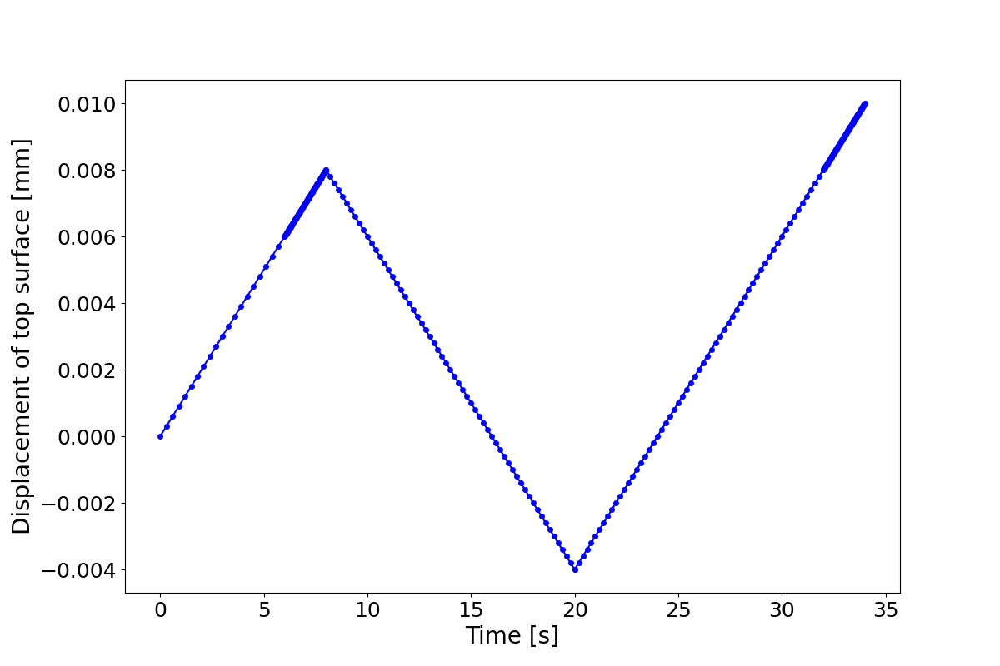

# Phase Field Fracture

## Formulation

### Minimization of Energy Functional

In the phase field framework, fracture processes can be determined via the minimization of the following energy functional over displacement field $\boldsymbol{u}$ and phase field variable $d$:

$$
\begin{align*} 
    \Pi(\boldsymbol{u}, d) = \int_{\Omega} \psi(\boldsymbol{\varepsilon}(\boldsymbol{u}), d)\textrm{ d}\Omega + \int_{\Omega}g_c\gamma(d, \nabla d)\textrm{ d}\Omega  - \int_{\Omega}\boldsymbol{b}\cdot\boldsymbol{u} \textrm{ d}\Omega - \int_{\Gamma_N}\boldsymbol{t}\cdot\boldsymbol{u} \textrm{ d}\Gamma, 
\end{align*}
$$

where $g_c$ is the Griffith-type critical energy release rate and $\gamma$ is the regularized crack surface density function (per volume):

$$
\begin{align*} 
    \gamma(d, \nabla d) = \frac{1}{2l}d^2 + \frac{l}{2} |\nabla d|^2,
\end{align*}
$$

with $l$ being the length-scale parameter. The bulk elastic energy $\psi$ is assumed to take the following form:

$$
\begin{align*}
    \psi(\boldsymbol{\varepsilon}, d) = g(d) \psi_{+}(\boldsymbol{\varepsilon}) + \psi_{-}(\boldsymbol{\varepsilon}),
\end{align*}
$$

with $g(d) = (1-d)^2$ being the degradation function that models partial loss of stiffness due to the presence of cracks. 


Miehe's model [1] of spectral decomposition of the strain tensor is adopted:

```math
\begin{align*} 
    \psi_{\pm}(\boldsymbol{\varepsilon}) &= \frac{\lambda}{2}\langle\textrm{tr}(\boldsymbol{\varepsilon})\rangle^2_{\pm} + \mu\boldsymbol{\varepsilon}_{\pm}:\boldsymbol{\varepsilon}_{\pm},
\end{align*}
```


where $`{\boldsymbol{\varepsilon}_{\pm}:=\Sigma_{a=1}^n \langle \epsilon_a \rangle_{\pm} \boldsymbol{n}_a \otimes \boldsymbol{n}_a}`$, with $`\{ \epsilon_a \}_{a=1}^n`$ and $`\{ \boldsymbol{n}_a \}_{a=1}^n`$ being the principal strains and principal directions of $\boldsymbol{\varepsilon}$, respectively. We have ${\langle x \rangle_{\pm}}:=\frac{1}{2}(x\pm|x|)$ being the bracket operator. Miehe's model prevents crack generation in compression.

### Strong Form

The governing equations and boundary conditions obtained by minimizing the total energy functional are: 

$$
\begin{align*}
    \nabla \cdot \boldsymbol{\sigma} + \boldsymbol{b} &= \boldsymbol{0} && \textrm{in}\nobreakspace \nobreakspace \Omega,  \\
    \frac{g_c}{l}\Big( d - l^2 \Delta d \Big) &= 2(1-d)  \mathcal{H} && \textrm{in} \nobreakspace \nobreakspace \Omega, \\
    \boldsymbol{u} &= \boldsymbol{u}_D && \textrm{on} \nobreakspace \nobreakspace \Gamma_D,  \\
    \boldsymbol{\sigma} \cdot \boldsymbol{n} &= \boldsymbol{t}   && \textrm{on} \nobreakspace\nobreakspace\Gamma_N, \\
    \nabla d \cdot \boldsymbol{n} &= 0    && \textrm{on} \nobreakspace\nobreakspace \Gamma,
\end{align*}
$$

where $\boldsymbol{\sigma} = \frac{\partial \psi}{\partial \boldsymbol{\varepsilon}}=g(d)\boldsymbol{\sigma}^+ + \boldsymbol{\sigma}^-$, and we have

$$
\begin{align*}
\boldsymbol{\sigma}^{\pm} = \frac{\partial \psi^{\pm}}{\partial \boldsymbol{\varepsilon}} = \lambda \langle\textrm{tr}(\boldsymbol{\varepsilon})\rangle_{\pm} \boldsymbol{I} + 2\mu \boldsymbol{\varepsilon}_{\pm}.
\end{align*}
$$

The history variable prevents crack from healing itself during unloading:

$$
\begin{align*}
 \mathcal{H}(\boldsymbol{x}, t)= \max_{s\in[0, t]}\psi_+(\boldsymbol{\varepsilon}(\boldsymbol{x}, s)).
\end{align*}
$$

### Weak Form

For arbitrary test function $(\delta\boldsymbol{u}, \delta d)$, we pose the following variational problem

$$
\begin{align*}
    a\big( (\boldsymbol{u}, d), (\delta\boldsymbol{u}, \delta d) \big) &= F\big( (\delta \boldsymbol{u}, \delta d) \big),
\end{align*}
$$

where we have

$$
\begin{align*}
    a\big( (\boldsymbol{u}, d), (\delta\boldsymbol{u}, \delta d) \big) &= \int_{\Omega} \boldsymbol{\sigma}(\boldsymbol{\varepsilon}, d):\nabla \delta \boldsymbol{u} \textrm{ d}\Omega + g_c\int_{\Omega} \Big(\frac{d}{l}\delta d + l\nabla d \cdot \nabla \delta d \Big)  \textrm{ d}\Omega + \int_{\Omega} 2\mathcal{H}d \nobreakspace \delta d \textrm{ d}\Omega, \\
    F\big( (\delta \boldsymbol{u}, \delta d) \big) &= \int_{\Gamma_N} \boldsymbol{t} \cdot \delta \boldsymbol{u} \textrm{ d}\Gamma + \int_{\Omega}\boldsymbol{b}\cdot\delta\boldsymbol{u} \textrm{ d}\Omega + \int_{\Omega} 2\mathcal{H}\delta d \textrm{ d}\Omega.
\end{align*}
$$

There are two common schemes to solve this coupled nonlinear problem: monolithic and staggered schemes. In this example, we use the staggered scheme. More details can be found in our paper [2]. 


### Eigenvalue/Eigenvector Derivative with Degeneracy

Before we move to the implementation section, caveats on computing the derivative of eigenvalues and eigenvectors (especially with **degenerate** eigenvalues) are briefly discussed here. One may tend to fully rely on _JAX_ automatic differentiation to compute the derivative of eigenvalues and eigenvectors. However, when repeated eigenvalues occur, _JAX_ native `jax.grad` may fail and return `np.nan`, as discussed in this [post](https://github.com/google/jax/issues/669). The issue has its own complexity, and is not resolved yet. 

One workaround is to add a small random noise to the matrix so that it always has distinct eigenvalues. This approach proves to be effective in our implementation of the phase field method. 

The second approach is to define [custom derivative rules](https://jax.readthedocs.io/en/latest/notebooks/Custom_derivative_rules_for_Python_code.html) with knowledge to handle repeated eigenvalues. In our example, _JAX-FEM_ needs to computes $\frac{\partial \boldsymbol{\sigma}}{\partial \boldsymbol{\varepsilon}}$, which further requires to compute $\frac{\partial \boldsymbol{\varepsilon}^+}{\partial \boldsymbol{\varepsilon}}$ and $\frac{\partial \boldsymbol{\varepsilon}^-}{\partial \boldsymbol{\varepsilon}}$. More generally, if a second order tensor $\boldsymbol{A}$ decompose as $`\boldsymbol{A} =\Sigma_{a=1}^n \lambda_a  \boldsymbol{n}_a \otimes \boldsymbol{n}_a`$ and we define tensor map  $`\boldsymbol{F}(\boldsymbol{A}):=\Sigma_{a=1}^n f(\lambda_a)  \boldsymbol{n}_a \otimes \boldsymbol{n}_a`$, then we are interested in computing $\frac{\partial \boldsymbol{F}}{\partial \boldsymbol{A}}$. The procedures are well presented in Miehe's paper [3], in particular, Eq. (19) is what we are concerned about. We implemented the algorithms in the file  [`eigen.py`](https://github.com/tianjuxue/jax-fem/blob/main/demos/phase_field_fracture/eigen.py). In this file, you will see how native AD of _JAX_ fails on repeated eigenvalues, but once custom derivative rules are specified, the issues is resolved.

Finally, make sure your _JAX_ version is up-to-date, since we have observed some possible unexpected behavior of the function `np.linalg.eigh` in older versions of _JAX_, e.g., 0.3.x version.


## Execution
Run
```bash
python -m demos.phase_field_fracture.example
```
from the `jax-fem/` directory.


## Results

Results can be visualized with *ParaWiew*.

<p align="middle">
  
</p>
<p align="middle">
    <em >Deformation (x10)</em>
</p>

<p align="middle">
   
  
</p>
<p align="middle">
    <em >Loading history and tensile force</em>
</p>


## References

[1] Miehe, Christian, Martina Hofacker, and Fabian Welschinger. "A phase field model for rate-independent crack propagation: Robust algorithmic implementation based on operator splits." *Computer Methods in Applied Mechanics and Engineering* 199.45-48 (2010): 2765-2778.

[2] Xue, Tianju, Sigrid Adriaenssens, and Sheng Mao. "Mapped phase field method for brittle fracture." *Computer Methods in Applied Mechanics and Engineering* 385 (2021): 114046.

[3] Miehe, Christian, and Matthias Lambrecht. "Algorithms for computation of stresses and elasticity moduli in terms of Seth–Hill's family of generalized strain tensors." *Communications in numerical methods in engineering* 17.5 (2001): 337-353.
