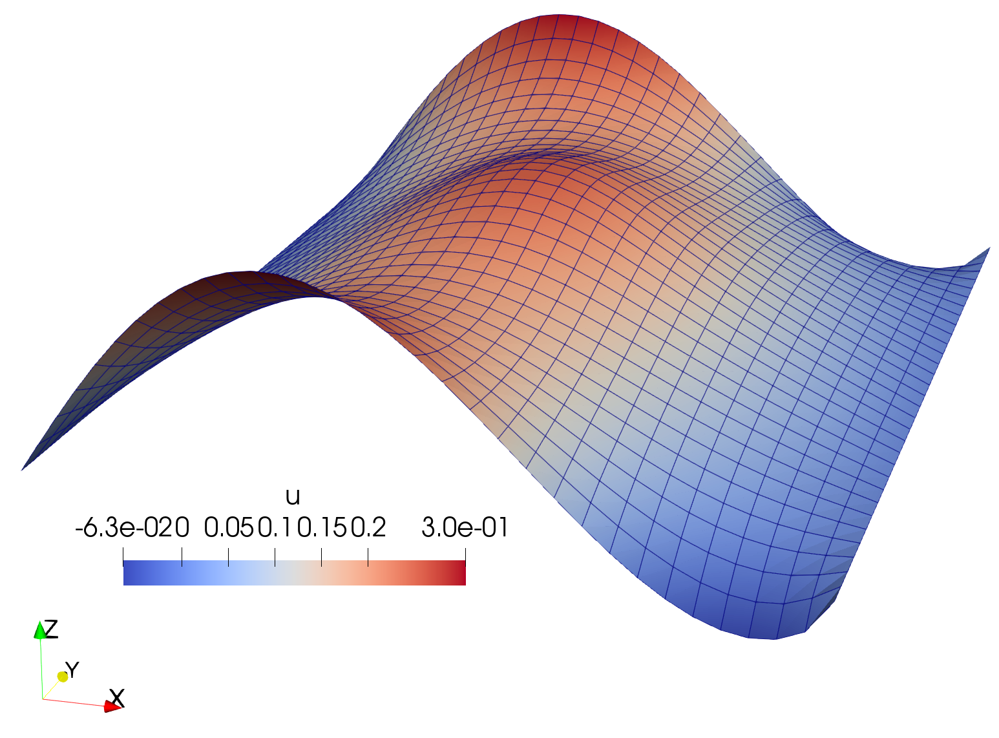

# Poisson's Equation

## Formulation

The Poisson's equation is the canonical elliptic partial differential equation. Consider a domain $\Omega \subset \mathbb{R}^\textrm{d}$ with boundary $\partial \Omega = \Gamma_D \cup \Gamma_N$, the strong form gives

$$
\begin{align*}
    -\nabla^2 u = b & \quad \textrm{in}  \nobreakspace \nobreakspace \Omega, \\
    u = 0 &  \quad\textrm{on} \nobreakspace \nobreakspace \Gamma_D,  \\
    \nabla u  \cdot \boldsymbol{n} = t  & \quad \textrm{on} \nobreakspace \nobreakspace \Gamma_N.
\end{align*}
$$

The weak form gives

$$
\begin{align*}
\int_{\Omega} \nabla u \cdot \nabla v \nobreakspace \nobreakspace \textrm{d}x = \int_{\Omega} b \nobreakspace v \nobreakspace \textrm{d}x + \int_{\Gamma_N} t\nobreakspace v \nobreakspace\nobreakspace \textrm{d}s.
\end{align*}
$$

We have the following definitions:
* $\Omega=(0,1)\times(0,1)$ (a unit square)
* $\Gamma_D=\{(0, x_2)\cup (1, x_2)\subset\partial\Omega\}$ (Dirichlet boundary)
* $\Gamma_N=\{(x_1, 0)\cup (x_1, 1)\subset\partial\Omega\}$ (Neumann boundary)
* $b=10\nobreakspace\textrm{exp}\big(-((x_1-0.5)^2+(x_2-0.5)^2)/0.02 \big)$
* $t=\textrm{sin}(5x_1)$

## Execution
Run
```bash
python -m demos.poisson.example
```
from the `jax-fem/` directory.


## Results

<p align="middle">
  
</p>
<p align="middle">
    <em >Solution</em>
</p>


## References

[1] https://fenicsproject.org/olddocs/dolfin/1.3.0/python/demo/documented/poisson/python/documentation.html

[2] Xue, Tianju, et al. "JAX-FEM: A differentiable GPU-accelerated 3D finite element solver for automatic inverse design and mechanistic data science." *Computer Physics Communications* (2023): 108802.